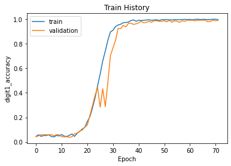

# COVID-19 公費疫苗預約平台驗證碼

### 免責條款

此專案是個人學習如何使用 Deep Learning 中的 CNN，使用 Python 的 Keras、Tensorflow 進行實作，請勿使用於不法用途。

### 參考資料

基本上都是參照之前我做過的驗證碼來用，需要的話也可以參考

[THSRC 高鐵訂票驗證碼](https://github.com/maxmilian/thsrc_captcha)

### Dependencies

*****2021-07-31 更新，使用 python 3.8 更新部分套件*****
請先安裝相關的 python 套件

```sh
pip3 install -r requirements.txt
```

### 步驟

大致上分為四個步驟，以下會分步驟說明
- 爬蟲
- 預處理
- 標記圖片
- CNN深度學習

### 爬蟲

爬蟲請參考 `crawler.ipynb` 和編譯出來的 `crawler.py`。此程式使用 requests 先取得網站 session 後，不斷的刷新 captcha 圖片，已抓下大量的原始訓練圖片。

檔案列表：

| # | ipython notebook 檔 | python檔 |
|---|---|---|
| 1 | crawler.ipynb | crawler.py |

### 預處理

此 captcha 其實相對簡單，目前只有使用 adaptiveThreshold 後，再加上 opening 運算。

檔案列表：

| # | ipython notebook 檔 | python檔 |
|---|---|---|
| 1 | preprocess.ipynb |  |
| 2 | preprocessBatch.ipynb | preprocessBatch.py |

### 標記圖片

標記圖片都是比較花時間，目前標記了 1000 張，已經達到足夠的準確率。

這邊一樣使用令外一個專案 [label_captcha_tool](https://github.com/maxmilian/label_captcha_tool)。主要是因為找了一些標記工具，發現有些是 windows 的，而或者是安裝有點麻煩，不如我就自己寫了一套網頁的版本，當然好處就是可以跨平台，也就是一個 html 而已，也不用安裝，算是大大節省我的時間。

這邊就標記檔，存成為 csv (`label.csv`)，每一個圖片一行，之後要丟入 CNN 當作 label 的訓練資料。

### CNN深度學習

CNN部分就直接使用參考資料 [THSRC 高鐵訂票驗證碼](https://github.com/maxmilian/thsrc_captcha) ，這部分優化比較少

| # | ipython notebook 檔 | python檔 |
|---|---|---|
| 1 | cnn.ipynb | |

這邊就標記檔，存成為 csv，每一個圖片一行，之後要丟入 CNN 當作 label 的訓練資料。

model.summary()

```sh
Model: "functional_1"
__________________________________________________________________________________________________
Layer (type)                    Output Shape         Param #     Connected to                     
==================================================================================================
input_1 (InputLayer)            [(None, 25, 125, 3)] 0                                            
__________________________________________________________________________________________________
conv2d (Conv2D)                 (None, 25, 125, 32)  896         input_1[0][0]                    
__________________________________________________________________________________________________
conv2d_1 (Conv2D)               (None, 25, 125, 32)  9248        conv2d[0][0]                     
__________________________________________________________________________________________________
max_pooling2d (MaxPooling2D)    (None, 13, 63, 32)   0           conv2d_1[0][0]                   
__________________________________________________________________________________________________
conv2d_2 (Conv2D)               (None, 13, 63, 64)   18496       max_pooling2d[0][0]              
__________________________________________________________________________________________________
conv2d_3 (Conv2D)               (None, 13, 63, 64)   36928       conv2d_2[0][0]                   
__________________________________________________________________________________________________
max_pooling2d_1 (MaxPooling2D)  (None, 7, 32, 64)    0           conv2d_3[0][0]                   
__________________________________________________________________________________________________
conv2d_4 (Conv2D)               (None, 7, 32, 128)   73856       max_pooling2d_1[0][0]            
__________________________________________________________________________________________________
conv2d_5 (Conv2D)               (None, 7, 32, 128)   147584      conv2d_4[0][0]                   
__________________________________________________________________________________________________
batch_normalization (BatchNorma (None, 7, 32, 128)   28          conv2d_5[0][0]                   
__________________________________________________________________________________________________
max_pooling2d_2 (MaxPooling2D)  (None, 4, 16, 128)   0           batch_normalization[0][0]        
__________________________________________________________________________________________________
conv2d_6 (Conv2D)               (None, 4, 16, 256)   295168      max_pooling2d_2[0][0]            
__________________________________________________________________________________________________
conv2d_7 (Conv2D)               (None, 4, 16, 256)   590080      conv2d_6[0][0]                   
__________________________________________________________________________________________________
max_pooling2d_3 (MaxPooling2D)  (None, 2, 8, 256)    0           conv2d_7[0][0]                   
__________________________________________________________________________________________________
conv2d_8 (Conv2D)               (None, 2, 8, 512)    1180160     max_pooling2d_3[0][0]            
__________________________________________________________________________________________________
batch_normalization_1 (BatchNor (None, 2, 8, 512)    8           conv2d_8[0][0]                   
__________________________________________________________________________________________________
max_pooling2d_4 (MaxPooling2D)  (None, 1, 4, 512)    0           batch_normalization_1[0][0]      
__________________________________________________________________________________________________
flatten (Flatten)               (None, 2048)         0           max_pooling2d_4[0][0]            
__________________________________________________________________________________________________
dropout (Dropout)               (None, 2048)         0           flatten[0][0]                    
__________________________________________________________________________________________________
digit1 (Dense)                  (None, 20)           40980       dropout[0][0]                    
__________________________________________________________________________________________________
digit2 (Dense)                  (None, 20)           40980       dropout[0][0]                    
__________________________________________________________________________________________________
digit3 (Dense)                  (None, 20)           40980       dropout[0][0]                    
__________________________________________________________________________________________________
digit4 (Dense)                  (None, 20)           40980       dropout[0][0]                    
__________________________________________________________________________________________________
digit5 (Dense)                  (None, 20)           40980       dropout[0][0]                    
__________________________________________________________________________________________________
digit6 (Dense)                  (None, 20)           40980       dropout[0][0]                    
==================================================================================================
Total params: 2,598,332
Trainable params: 2,598,314
Non-trainable params: 18
__________________________________________________________________________________________________
```

model.fit log

```sh
Epoch 1/100
 1/48 [..............................] - ETA: 0s - loss: 30.3931 - digit1_loss: 4.5869 - digit2_loss: 5.9813 - digit3_loss: 4.8816 - digit4_loss: 5.0081 - digit5_loss: 5.0849 - digit6_loss: 4.8503 - digit1_accuracy: 0.0500 - digit2_accuracy: 0.1000 - digit3_accuracy: 0.0000e+00 - digit4_accuracy: 0.0500 - digit5_accuracy: 0.0000e+00 - digit6_accuracy: 0.1000WARNING:tensorflow:From /Users/maxmilian/miniconda3/lib/python3.8/site-packages/tensorflow/python/ops/summary_ops_v2.py:1277: stop (from tensorflow.python.eager.profiler) is deprecated and will be removed after 2020-07-01.
Instructions for updating:
use `tf.profiler.experimental.stop` instead.
48/48 [==============================] - ETA: 0s - loss: 25.8488 - digit1_loss: 4.2827 - digit2_loss: 4.3626 - digit3_loss: 4.2921 - digit4_loss: 4.2800 - digit5_loss: 4.3355 - digit6_loss: 4.2960 - digit1_accuracy: 0.0448 - digit2_accuracy: 0.0562 - digit3_accuracy: 0.0490 - digit4_accuracy: 0.0531 - digit5_accuracy: 0.0448 - digit6_accuracy: 0.0594
Epoch 00001: val_digit4_accuracy improved from -inf to 0.02500, saving model to model/01-25.85-18.12.hdf5
48/48 [==============================] - 22s 463ms/step - loss: 25.8488 - digit1_loss: 4.2827 - digit2_loss: 4.3626 - digit3_loss: 4.2921 - digit4_loss: 4.2800 - digit5_loss: 4.3355 - digit6_loss: 4.2960 - digit1_accuracy: 0.0448 - digit2_accuracy: 0.0562 - digit3_accuracy: 0.0490 - digit4_accuracy: 0.0531 - digit5_accuracy: 0.0448 - digit6_accuracy: 0.0594 - val_loss: 18.1196 - val_digit1_loss: 3.0349 - val_digit2_loss: 2.9792 - val_digit3_loss: 3.0008 - val_digit4_loss: 3.0405 - val_digit5_loss: 3.0457 - val_digit6_loss: 3.0186 - val_digit1_accuracy: 0.0417 - val_digit2_accuracy: 0.0792 - val_digit3_accuracy: 0.0542 - val_digit4_accuracy: 0.0250 - val_digit5_accuracy: 0.0583 - val_digit6_accuracy: 0.0458
Epoch 2/100
48/48 [==============================] - ETA: 0s - loss: 23.3785 - digit1_loss: 3.9251 - digit2_loss: 3.9178 - digit3_loss: 3.8761 - digit4_loss: 3.8350 - digit5_loss: 3.8733 - digit6_loss: 3.9512 - digit1_accuracy: 0.0583 - digit2_accuracy: 0.0469 - digit3_accuracy: 0.0427 - digit4_accuracy: 0.0667 - digit5_accuracy: 0.0667 - digit6_accuracy: 0.0521
Epoch 00002: val_digit4_accuracy improved from 0.02500 to 0.05417, saving model to model/02-23.38-18.32.hdf5
48/48 [==============================] - 18s 369ms/step - loss: 23.3785 - digit1_loss: 3.9251 - digit2_loss: 3.9178 - digit3_loss: 3.8761 - digit4_loss: 3.8350 - digit5_loss: 3.8733 - digit6_loss: 3.9512 - digit1_accuracy: 0.0583 - digit2_accuracy: 0.0469 - digit3_accuracy: 0.0427 - digit4_accuracy: 0.0667 - digit5_accuracy: 0.0667 - digit6_accuracy: 0.0521 - val_loss: 18.3202 - val_digit1_loss: 3.0971 - val_digit2_loss: 3.0076 - val_digit3_loss: 3.0321 - val_digit4_loss: 3.0339 - val_digit5_loss: 3.0986 - val_digit6_loss: 3.0510 - val_digit1_accuracy: 0.0500 - val_digit2_accuracy: 0.0750 - val_digit3_accuracy: 0.0250 - val_digit4_accuracy: 0.0542 - val_digit5_accuracy: 0.0208 - val_digit6_accuracy: 0.0500
Epoch 3/100
48/48 [==============================] - ETA: 0s - loss: 22.7737 - digit1_loss: 3.8462 - digit2_loss: 3.7785 - digit3_loss: 3.7893 - digit4_loss: 3.7860 - digit5_loss: 3.8056 - digit6_loss: 3.7680 - digit1_accuracy: 0.0448 - digit2_accuracy: 0.0552 - digit3_accuracy: 0.0385 - digit4_accuracy: 0.0573 - digit5_accuracy: 0.0531 - digit6_accuracy: 0.0583
Epoch 00003: val_digit4_accuracy did not improve from 0.05417
48/48 [==============================] - 18s 372ms/step - loss: 22.7737 - digit1_loss: 3.8462 - digit2_loss: 3.7785 - digit3_loss: 3.7893 - digit4_loss: 3.7860 - digit5_loss: 3.8056 - digit6_loss: 3.7680 - digit1_accuracy: 0.0448 - digit2_accuracy: 0.0552 - digit3_accuracy: 0.0385 - digit4_accuracy: 0.0573 - digit5_accuracy: 0.0531 - digit6_accuracy: 0.0583 - val_loss: 18.2979 - val_digit1_loss: 3.0949 - val_digit2_loss: 3.0076 - val_digit3_loss: 3.0261 - val_digit4_loss: 3.0347 - val_digit5_loss: 3.0699 - val_digit6_loss: 3.0648 - val_digit1_accuracy: 0.0583 - val_digit2_accuracy: 0.0667 - val_digit3_accuracy: 0.0583 - val_digit4_accuracy: 0.0250 - val_digit5_accuracy: 0.0542 - val_digit6_accuracy: 0.0375
Epoch 4/100
48/48 [==============================] - ETA: 0s - loss: 22.0062 - digit1_loss: 3.6627 - digit2_loss: 3.6731 - digit3_loss: 3.6672 - digit4_loss: 3.6624 - digit5_loss: 3.6908 - digit6_loss: 3.6499 - digit1_accuracy: 0.0521 - digit2_accuracy: 0.0583 - digit3_accuracy: 0.0625 - digit4_accuracy: 0.0500 - digit5_accuracy: 0.0625 - digit6_accuracy: 0.0542
Epoch 00004: val_digit4_accuracy did not improve from 0.05417
48/48 [==============================] - 18s 375ms/step - loss: 22.0062 - digit1_loss: 3.6627 - digit2_loss: 3.6731 - digit3_loss: 3.6672 - digit4_loss: 3.6624 - digit5_loss: 3.6908 - digit6_loss: 3.6499 - digit1_accuracy: 0.0521 - digit2_accuracy: 0.0583 - digit3_accuracy: 0.0625 - digit4_accuracy: 0.0500 - digit5_accuracy: 0.0625 - digit6_accuracy: 0.0542 - val_loss: 18.2836 - val_digit1_loss: 3.1282 - val_digit2_loss: 3.0015 - val_digit3_loss: 3.0182 - val_digit4_loss: 3.0278 - val_digit5_loss: 3.0755 - val_digit6_loss: 3.0324 - val_digit1_accuracy: 0.0583 - val_digit2_accuracy: 0.0750 - val_digit3_accuracy: 0.0667 - val_digit4_accuracy: 0.0208 - val_digit5_accuracy: 0.0208 - val_digit6_accuracy: 0.0750
Epoch 5/100
48/48 [==============================] - ETA: 0s - loss: 21.3194 - digit1_loss: 3.5369 - digit2_loss: 3.5441 - digit3_loss: 3.5250 - digit4_loss: 3.6219 - digit5_loss: 3.6005 - digit6_loss: 3.4909 - digit1_accuracy: 0.0521 - digit2_accuracy: 0.0490 - digit3_accuracy: 0.0500 - digit4_accuracy: 0.0312 - digit5_accuracy: 0.0521 - digit6_accuracy: 0.0417
Epoch 00005: val_digit4_accuracy did not improve from 0.05417
48/48 [==============================] - 20s 424ms/step - loss: 21.3194 - digit1_loss: 3.5369 - digit2_loss: 3.5441 - digit3_loss: 3.5250 - digit4_loss: 3.6219 - digit5_loss: 3.6005 - digit6_loss: 3.4909 - digit1_accuracy: 0.0521 - digit2_accuracy: 0.0490 - digit3_accuracy: 0.0500 - digit4_accuracy: 0.0312 - digit5_accuracy: 0.0521 - digit6_accuracy: 0.0417 - val_loss: 18.2316 - val_digit1_loss: 3.0981 - val_digit2_loss: 2.9986 - val_digit3_loss: 3.0018 - val_digit4_loss: 3.0250 - val_digit5_loss: 3.0736 - val_digit6_loss: 3.0346 - val_digit1_accuracy: 0.0583 - val_digit2_accuracy: 0.0750 - val_digit3_accuracy: 0.0625 - val_digit4_accuracy: 0.0542 - val_digit5_accuracy: 0.0542 - val_digit6_accuracy: 0.0375
Epoch 6/100
48/48 [==============================] - ETA: 0s - loss: 20.2191 - digit1_loss: 3.3501 - digit2_loss: 3.3708 - digit3_loss: 3.4038 - digit4_loss: 3.3423 - digit5_loss: 3.3669 - digit6_loss: 3.3852 - digit1_accuracy: 0.0573 - digit2_accuracy: 0.0542 - digit3_accuracy: 0.0448 - digit4_accuracy: 0.0458 - digit5_accuracy: 0.0646 - digit6_accuracy: 0.0427
Epoch 00006: val_digit4_accuracy did not improve from 0.05417
48/48 [==============================] - 18s 377ms/step - loss: 20.2191 - digit1_loss: 3.3501 - digit2_loss: 3.3708 - digit3_loss: 3.4038 - digit4_loss: 3.3423 - digit5_loss: 3.3669 - digit6_loss: 3.3852 - digit1_accuracy: 0.0573 - digit2_accuracy: 0.0542 - digit3_accuracy: 0.0448 - digit4_accuracy: 0.0458 - digit5_accuracy: 0.0646 - digit6_accuracy: 0.0427 - val_loss: 18.1470 - val_digit1_loss: 3.0524 - val_digit2_loss: 2.9887 - val_digit3_loss: 3.0125 - val_digit4_loss: 3.0119 - val_digit5_loss: 3.0594 - val_digit6_loss: 3.0220 - val_digit1_accuracy: 0.0583 - val_digit2_accuracy: 0.0750 - val_digit3_accuracy: 0.0708 - val_digit4_accuracy: 0.0250 - val_digit5_accuracy: 0.0542 - val_digit6_accuracy: 0.0750
Epoch 7/100
48/48 [==============================] - ETA: 0s - loss: 19.3886 - digit1_loss: 3.2386 - digit2_loss: 3.2499 - digit3_loss: 3.2164 - digit4_loss: 3.2089 - digit5_loss: 3.2854 - digit6_loss: 3.1894 - digit1_accuracy: 0.0437 - digit2_accuracy: 0.0448 - digit3_accuracy: 0.0615 - digit4_accuracy: 0.0594 - digit5_accuracy: 0.0448 - digit6_accuracy: 0.0500
Epoch 00007: val_digit4_accuracy improved from 0.05417 to 0.05833, saving model to model/07-19.39-18.15.hdf5
48/48 [==============================] - 18s 377ms/step - loss: 19.3886 - digit1_loss: 3.2386 - digit2_loss: 3.2499 - digit3_loss: 3.2164 - digit4_loss: 3.2089 - digit5_loss: 3.2854 - digit6_loss: 3.1894 - digit1_accuracy: 0.0437 - digit2_accuracy: 0.0448 - digit3_accuracy: 0.0615 - digit4_accuracy: 0.0594 - digit5_accuracy: 0.0448 - digit6_accuracy: 0.0500 - val_loss: 18.1489 - val_digit1_loss: 3.0683 - val_digit2_loss: 2.9858 - val_digit3_loss: 2.9968 - val_digit4_loss: 2.9973 - val_digit5_loss: 3.0750 - val_digit6_loss: 3.0257 - val_digit1_accuracy: 0.0583 - val_digit2_accuracy: 0.0667 - val_digit3_accuracy: 0.0542 - val_digit4_accuracy: 0.0583 - val_digit5_accuracy: 0.0542 - val_digit6_accuracy: 0.0458
Epoch 8/100
48/48 [==============================] - ETA: 0s - loss: 18.8047 - digit1_loss: 3.1645 - digit2_loss: 3.1119 - digit3_loss: 3.1135 - digit4_loss: 3.1398 - digit5_loss: 3.1606 - digit6_loss: 3.1142 - digit1_accuracy: 0.0406 - digit2_accuracy: 0.0500 - digit3_accuracy: 0.0510 - digit4_accuracy: 0.0479 - digit5_accuracy: 0.0677 - digit6_accuracy: 0.0448
Epoch 00008: val_digit4_accuracy did not improve from 0.05833
48/48 [==============================] - 17s 360ms/step - loss: 18.8047 - digit1_loss: 3.1645 - digit2_loss: 3.1119 - digit3_loss: 3.1135 - digit4_loss: 3.1398 - digit5_loss: 3.1606 - digit6_loss: 3.1142 - digit1_accuracy: 0.0406 - digit2_accuracy: 0.0500 - digit3_accuracy: 0.0510 - digit4_accuracy: 0.0479 - digit5_accuracy: 0.0677 - digit6_accuracy: 0.0448 - val_loss: 18.1242 - val_digit1_loss: 3.0591 - val_digit2_loss: 2.9833 - val_digit3_loss: 2.9959 - val_digit4_loss: 3.0027 - val_digit5_loss: 3.0592 - val_digit6_loss: 3.0240 - val_digit1_accuracy: 0.0500 - val_digit2_accuracy: 0.0750 - val_digit3_accuracy: 0.0667 - val_digit4_accuracy: 0.0542 - val_digit5_accuracy: 0.0208 - val_digit6_accuracy: 0.0375
Epoch 9/100
48/48 [==============================] - ETA: 0s - loss: 18.4111 - digit1_loss: 3.1058 - digit2_loss: 3.0570 - digit3_loss: 3.0449 - digit4_loss: 3.0656 - digit5_loss: 3.0776 - digit6_loss: 3.0604 - digit1_accuracy: 0.0531 - digit2_accuracy: 0.0458 - digit3_accuracy: 0.0635 - digit4_accuracy: 0.0573 - digit5_accuracy: 0.0573 - digit6_accuracy: 0.0510
Epoch 00009: val_digit4_accuracy improved from 0.05833 to 0.07917, saving model to model/09-18.41-18.07.hdf5
48/48 [==============================] - 18s 376ms/step - loss: 18.4111 - digit1_loss: 3.1058 - digit2_loss: 3.0570 - digit3_loss: 3.0449 - digit4_loss: 3.0656 - digit5_loss: 3.0776 - digit6_loss: 3.0604 - digit1_accuracy: 0.0531 - digit2_accuracy: 0.0458 - digit3_accuracy: 0.0635 - digit4_accuracy: 0.0573 - digit5_accuracy: 0.0573 - digit6_accuracy: 0.0510 - val_loss: 18.0673 - val_digit1_loss: 3.0433 - val_digit2_loss: 2.9823 - val_digit3_loss: 2.9951 - val_digit4_loss: 2.9909 - val_digit5_loss: 3.0353 - val_digit6_loss: 3.0204 - val_digit1_accuracy: 0.0583 - val_digit2_accuracy: 0.0542 - val_digit3_accuracy: 0.0417 - val_digit4_accuracy: 0.0792 - val_digit5_accuracy: 0.0542 - val_digit6_accuracy: 0.0333
Epoch 10/100
48/48 [==============================] - ETA: 0s - loss: 18.2432 - digit1_loss: 3.0625 - digit2_loss: 3.0259 - digit3_loss: 3.0244 - digit4_loss: 3.0485 - digit5_loss: 3.0397 - digit6_loss: 3.0423 - digit1_accuracy: 0.0479 - digit2_accuracy: 0.0552 - digit3_accuracy: 0.0542 - digit4_accuracy: 0.0521 - digit5_accuracy: 0.0583 - digit6_accuracy: 0.0469
Epoch 00010: val_digit4_accuracy did not improve from 0.07917
48/48 [==============================] - 18s 368ms/step - loss: 18.2432 - digit1_loss: 3.0625 - digit2_loss: 3.0259 - digit3_loss: 3.0244 - digit4_loss: 3.0485 - digit5_loss: 3.0397 - digit6_loss: 3.0423 - digit1_accuracy: 0.0479 - digit2_accuracy: 0.0552 - digit3_accuracy: 0.0542 - digit4_accuracy: 0.0521 - digit5_accuracy: 0.0583 - digit6_accuracy: 0.0469 - val_loss: 18.0477 - val_digit1_loss: 3.0468 - val_digit2_loss: 2.9975 - val_digit3_loss: 2.9830 - val_digit4_loss: 2.9877 - val_digit5_loss: 3.0281 - val_digit6_loss: 3.0046 - val_digit1_accuracy: 0.0583 - val_digit2_accuracy: 0.0375 - val_digit3_accuracy: 0.0458 - val_digit4_accuracy: 0.0542 - val_digit5_accuracy: 0.0208 - val_digit6_accuracy: 0.0458
Epoch 11/100
48/48 [==============================] - ETA: 0s - loss: 18.1847 - digit1_loss: 3.0292 - digit2_loss: 3.0140 - digit3_loss: 3.0300 - digit4_loss: 3.0315 - digit5_loss: 3.0538 - digit6_loss: 3.0262 - digit1_accuracy: 0.0604 - digit2_accuracy: 0.0594 - digit3_accuracy: 0.0510 - digit4_accuracy: 0.0500 - digit5_accuracy: 0.0562 - digit6_accuracy: 0.0427
Epoch 00011: val_digit4_accuracy did not improve from 0.07917
48/48 [==============================] - 18s 375ms/step - loss: 18.1847 - digit1_loss: 3.0292 - digit2_loss: 3.0140 - digit3_loss: 3.0300 - digit4_loss: 3.0315 - digit5_loss: 3.0538 - digit6_loss: 3.0262 - digit1_accuracy: 0.0604 - digit2_accuracy: 0.0594 - digit3_accuracy: 0.0510 - digit4_accuracy: 0.0500 - digit5_accuracy: 0.0562 - digit6_accuracy: 0.0427 - val_loss: 18.0111 - val_digit1_loss: 3.0285 - val_digit2_loss: 2.9918 - val_digit3_loss: 2.9764 - val_digit4_loss: 2.9932 - val_digit5_loss: 3.0199 - val_digit6_loss: 3.0012 - val_digit1_accuracy: 0.0417 - val_digit2_accuracy: 0.0583 - val_digit3_accuracy: 0.0792 - val_digit4_accuracy: 0.0667 - val_digit5_accuracy: 0.0542 - val_digit6_accuracy: 0.0583
Epoch 12/100
48/48 [==============================] - ETA: 0s - loss: 18.0905 - digit1_loss: 3.0113 - digit2_loss: 3.0053 - digit3_loss: 3.0338 - digit4_loss: 3.0223 - digit5_loss: 3.0160 - digit6_loss: 3.0019 - digit1_accuracy: 0.0469 - digit2_accuracy: 0.0625 - digit3_accuracy: 0.0437 - digit4_accuracy: 0.0448 - digit5_accuracy: 0.0469 - digit6_accuracy: 0.0490
Epoch 00012: val_digit4_accuracy did not improve from 0.07917
48/48 [==============================] - 19s 395ms/step - loss: 18.0905 - digit1_loss: 3.0113 - digit2_loss: 3.0053 - digit3_loss: 3.0338 - digit4_loss: 3.0223 - digit5_loss: 3.0160 - digit6_loss: 3.0019 - digit1_accuracy: 0.0469 - digit2_accuracy: 0.0625 - digit3_accuracy: 0.0437 - digit4_accuracy: 0.0448 - digit5_accuracy: 0.0469 - digit6_accuracy: 0.0490 - val_loss: 18.0187 - val_digit1_loss: 3.0265 - val_digit2_loss: 2.9905 - val_digit3_loss: 2.9904 - val_digit4_loss: 2.9912 - val_digit5_loss: 3.0191 - val_digit6_loss: 3.0010 - val_digit1_accuracy: 0.0417 - val_digit2_accuracy: 0.0458 - val_digit3_accuracy: 0.1000 - val_digit4_accuracy: 0.0500 - val_digit5_accuracy: 0.0208 - val_digit6_accuracy: 0.0625
Epoch 13/100
48/48 [==============================] - ETA: 0s - loss: 18.0653 - digit1_loss: 3.0008 - digit2_loss: 3.0223 - digit3_loss: 3.0096 - digit4_loss: 3.0028 - digit5_loss: 3.0127 - digit6_loss: 3.0170 - digit1_accuracy: 0.0437 - digit2_accuracy: 0.0479 - digit3_accuracy: 0.0625 - digit4_accuracy: 0.0646 - digit5_accuracy: 0.0625 - digit6_accuracy: 0.0490
Epoch 00013: val_digit4_accuracy did not improve from 0.07917
48/48 [==============================] - 18s 379ms/step - loss: 18.0653 - digit1_loss: 3.0008 - digit2_loss: 3.0223 - digit3_loss: 3.0096 - digit4_loss: 3.0028 - digit5_loss: 3.0127 - digit6_loss: 3.0170 - digit1_accuracy: 0.0437 - digit2_accuracy: 0.0479 - digit3_accuracy: 0.0625 - digit4_accuracy: 0.0646 - digit5_accuracy: 0.0625 - digit6_accuracy: 0.0490 - val_loss: 18.0192 - val_digit1_loss: 3.0286 - val_digit2_loss: 3.0014 - val_digit3_loss: 2.9807 - val_digit4_loss: 2.9927 - val_digit5_loss: 3.0167 - val_digit6_loss: 2.9992 - val_digit1_accuracy: 0.0417 - val_digit2_accuracy: 0.0458 - val_digit3_accuracy: 0.0792 - val_digit4_accuracy: 0.0792 - val_digit5_accuracy: 0.0542 - val_digit6_accuracy: 0.0458
Epoch 14/100
48/48 [==============================] - ETA: 0s - loss: 18.0199 - digit1_loss: 2.9991 - digit2_loss: 2.9994 - digit3_loss: 3.0094 - digit4_loss: 2.9997 - digit5_loss: 3.0062 - digit6_loss: 3.0061 - digit1_accuracy: 0.0542 - digit2_accuracy: 0.0562 - digit3_accuracy: 0.0708 - digit4_accuracy: 0.0552 - digit5_accuracy: 0.0604 - digit6_accuracy: 0.0469
Epoch 00014: val_digit4_accuracy did not improve from 0.07917
48/48 [==============================] - 18s 372ms/step - loss: 18.0199 - digit1_loss: 2.9991 - digit2_loss: 2.9994 - digit3_loss: 3.0094 - digit4_loss: 2.9997 - digit5_loss: 3.0062 - digit6_loss: 3.0061 - digit1_accuracy: 0.0542 - digit2_accuracy: 0.0562 - digit3_accuracy: 0.0708 - digit4_accuracy: 0.0552 - digit5_accuracy: 0.0604 - digit6_accuracy: 0.0469 - val_loss: 18.0095 - val_digit1_loss: 3.0211 - val_digit2_loss: 3.0033 - val_digit3_loss: 2.9846 - val_digit4_loss: 2.9875 - val_digit5_loss: 3.0159 - val_digit6_loss: 2.9972 - val_digit1_accuracy: 0.0375 - val_digit2_accuracy: 0.0375 - val_digit3_accuracy: 0.0667 - val_digit4_accuracy: 0.0792 - val_digit5_accuracy: 0.0417 - val_digit6_accuracy: 0.0542
Epoch 15/100
48/48 [==============================] - ETA: 0s - loss: 18.0066 - digit1_loss: 3.0022 - digit2_loss: 3.0009 - digit3_loss: 3.0018 - digit4_loss: 3.0015 - digit5_loss: 2.9994 - digit6_loss: 3.0008 - digit1_accuracy: 0.0646 - digit2_accuracy: 0.0531 - digit3_accuracy: 0.0583 - digit4_accuracy: 0.0615 - digit5_accuracy: 0.0510 - digit6_accuracy: 0.0458
Epoch 00015: val_digit4_accuracy did not improve from 0.07917
48/48 [==============================] - 18s 368ms/step - loss: 18.0066 - digit1_loss: 3.0022 - digit2_loss: 3.0009 - digit3_loss: 3.0018 - digit4_loss: 3.0015 - digit5_loss: 2.9994 - digit6_loss: 3.0008 - digit1_accuracy: 0.0646 - digit2_accuracy: 0.0531 - digit3_accuracy: 0.0583 - digit4_accuracy: 0.0615 - digit5_accuracy: 0.0510 - digit6_accuracy: 0.0458 - val_loss: 17.9778 - val_digit1_loss: 3.0159 - val_digit2_loss: 2.9972 - val_digit3_loss: 2.9766 - val_digit4_loss: 2.9852 - val_digit5_loss: 3.0040 - val_digit6_loss: 2.9988 - val_digit1_accuracy: 0.0417 - val_digit2_accuracy: 0.0583 - val_digit3_accuracy: 0.0542 - val_digit4_accuracy: 0.0792 - val_digit5_accuracy: 0.0208 - val_digit6_accuracy: 0.0542
Epoch 16/100
48/48 [==============================] - ETA: 0s - loss: 17.9825 - digit1_loss: 2.9973 - digit2_loss: 2.9931 - digit3_loss: 3.0040 - digit4_loss: 2.9982 - digit5_loss: 2.9976 - digit6_loss: 2.9925 - digit1_accuracy: 0.0448 - digit2_accuracy: 0.0688 - digit3_accuracy: 0.0552 - digit4_accuracy: 0.0760 - digit5_accuracy: 0.0490 - digit6_accuracy: 0.0583
Epoch 00016: val_digit4_accuracy did not improve from 0.07917
48/48 [==============================] - 18s 373ms/step - loss: 17.9825 - digit1_loss: 2.9973 - digit2_loss: 2.9931 - digit3_loss: 3.0040 - digit4_loss: 2.9982 - digit5_loss: 2.9976 - digit6_loss: 2.9925 - digit1_accuracy: 0.0448 - digit2_accuracy: 0.0688 - digit3_accuracy: 0.0552 - digit4_accuracy: 0.0760 - digit5_accuracy: 0.0490 - digit6_accuracy: 0.0583 - val_loss: 17.9635 - val_digit1_loss: 3.0034 - val_digit2_loss: 2.9906 - val_digit3_loss: 2.9859 - val_digit4_loss: 2.9895 - val_digit5_loss: 2.9998 - val_digit6_loss: 2.9943 - val_digit1_accuracy: 0.0667 - val_digit2_accuracy: 0.0583 - val_digit3_accuracy: 0.0667 - val_digit4_accuracy: 0.0750 - val_digit5_accuracy: 0.0542 - val_digit6_accuracy: 0.0708
Epoch 17/100
48/48 [==============================] - ETA: 0s - loss: 17.8594 - digit1_loss: 2.9768 - digit2_loss: 2.9679 - digit3_loss: 2.9874 - digit4_loss: 2.9778 - digit5_loss: 2.9808 - digit6_loss: 2.9687 - digit1_accuracy: 0.0688 - digit2_accuracy: 0.0833 - digit3_accuracy: 0.0771 - digit4_accuracy: 0.0646 - digit5_accuracy: 0.0698 - digit6_accuracy: 0.0771
Epoch 00017: val_digit4_accuracy did not improve from 0.07917
48/48 [==============================] - 18s 374ms/step - loss: 17.8594 - digit1_loss: 2.9768 - digit2_loss: 2.9679 - digit3_loss: 2.9874 - digit4_loss: 2.9778 - digit5_loss: 2.9808 - digit6_loss: 2.9687 - digit1_accuracy: 0.0688 - digit2_accuracy: 0.0833 - digit3_accuracy: 0.0771 - digit4_accuracy: 0.0646 - digit5_accuracy: 0.0698 - digit6_accuracy: 0.0771 - val_loss: 17.8934 - val_digit1_loss: 2.9914 - val_digit2_loss: 2.9765 - val_digit3_loss: 2.9746 - val_digit4_loss: 2.9856 - val_digit5_loss: 2.9879 - val_digit6_loss: 2.9774 - val_digit1_accuracy: 0.0708 - val_digit2_accuracy: 0.0875 - val_digit3_accuracy: 0.0750 - val_digit4_accuracy: 0.0458 - val_digit5_accuracy: 0.0750 - val_digit6_accuracy: 0.0583
Epoch 18/100
48/48 [==============================] - ETA: 0s - loss: 17.6267 - digit1_loss: 2.9314 - digit2_loss: 2.9141 - digit3_loss: 2.9525 - digit4_loss: 2.9597 - digit5_loss: 2.9511 - digit6_loss: 2.9179 - digit1_accuracy: 0.0854 - digit2_accuracy: 0.0969 - digit3_accuracy: 0.0833 - digit4_accuracy: 0.0771 - digit5_accuracy: 0.0781 - digit6_accuracy: 0.0906
Epoch 00018: val_digit4_accuracy improved from 0.07917 to 0.10833, saving model to model/18-17.63-17.63.hdf5
48/48 [==============================] - 18s 375ms/step - loss: 17.6267 - digit1_loss: 2.9314 - digit2_loss: 2.9141 - digit3_loss: 2.9525 - digit4_loss: 2.9597 - digit5_loss: 2.9511 - digit6_loss: 2.9179 - digit1_accuracy: 0.0854 - digit2_accuracy: 0.0969 - digit3_accuracy: 0.0833 - digit4_accuracy: 0.0771 - digit5_accuracy: 0.0781 - digit6_accuracy: 0.0906 - val_loss: 17.6314 - val_digit1_loss: 2.9442 - val_digit2_loss: 2.9301 - val_digit3_loss: 2.9322 - val_digit4_loss: 2.9504 - val_digit5_loss: 2.9545 - val_digit6_loss: 2.9201 - val_digit1_accuracy: 0.0875 - val_digit2_accuracy: 0.0833 - val_digit3_accuracy: 0.1125 - val_digit4_accuracy: 0.1083 - val_digit5_accuracy: 0.1000 - val_digit6_accuracy: 0.0917
Epoch 19/100
48/48 [==============================] - ETA: 0s - loss: 17.3128 - digit1_loss: 2.8283 - digit2_loss: 2.8877 - digit3_loss: 2.9261 - digit4_loss: 2.9119 - digit5_loss: 2.8962 - digit6_loss: 2.8627 - digit1_accuracy: 0.1042 - digit2_accuracy: 0.0823 - digit3_accuracy: 0.0823 - digit4_accuracy: 0.0885 - digit5_accuracy: 0.0896 - digit6_accuracy: 0.0990
Epoch 00019: val_digit4_accuracy did not improve from 0.10833
48/48 [==============================] - 19s 391ms/step - loss: 17.3128 - digit1_loss: 2.8283 - digit2_loss: 2.8877 - digit3_loss: 2.9261 - digit4_loss: 2.9119 - digit5_loss: 2.8962 - digit6_loss: 2.8627 - digit1_accuracy: 0.1042 - digit2_accuracy: 0.0823 - digit3_accuracy: 0.0823 - digit4_accuracy: 0.0885 - digit5_accuracy: 0.0896 - digit6_accuracy: 0.0990 - val_loss: 17.7008 - val_digit1_loss: 2.9358 - val_digit2_loss: 2.9503 - val_digit3_loss: 2.9607 - val_digit4_loss: 2.9581 - val_digit5_loss: 2.9530 - val_digit6_loss: 2.9429 - val_digit1_accuracy: 0.0958 - val_digit2_accuracy: 0.0583 - val_digit3_accuracy: 0.0667 - val_digit4_accuracy: 0.0583 - val_digit5_accuracy: 0.0542 - val_digit6_accuracy: 0.1000
Epoch 20/100
48/48 [==============================] - ETA: 0s - loss: 16.7180 - digit1_loss: 2.7353 - digit2_loss: 2.7797 - digit3_loss: 2.8556 - digit4_loss: 2.8231 - digit5_loss: 2.7902 - digit6_loss: 2.7339 - digit1_accuracy: 0.1177 - digit2_accuracy: 0.1021 - digit3_accuracy: 0.1135 - digit4_accuracy: 0.1156 - digit5_accuracy: 0.1125 - digit6_accuracy: 0.1302
Epoch 00020: val_digit4_accuracy did not improve from 0.10833
48/48 [==============================] - 18s 379ms/step - loss: 16.7180 - digit1_loss: 2.7353 - digit2_loss: 2.7797 - digit3_loss: 2.8556 - digit4_loss: 2.8231 - digit5_loss: 2.7902 - digit6_loss: 2.7339 - digit1_accuracy: 0.1177 - digit2_accuracy: 0.1021 - digit3_accuracy: 0.1135 - digit4_accuracy: 0.1156 - digit5_accuracy: 0.1125 - digit6_accuracy: 0.1302 - val_loss: 16.9495 - val_digit1_loss: 2.8112 - val_digit2_loss: 2.8238 - val_digit3_loss: 2.8329 - val_digit4_loss: 2.8505 - val_digit5_loss: 2.8481 - val_digit6_loss: 2.7829 - val_digit1_accuracy: 0.1208 - val_digit2_accuracy: 0.1250 - val_digit3_accuracy: 0.1458 - val_digit4_accuracy: 0.1083 - val_digit5_accuracy: 0.1042 - val_digit6_accuracy: 0.1708
Epoch 21/100
48/48 [==============================] - ETA: 0s - loss: 15.9744 - digit1_loss: 2.5743 - digit2_loss: 2.6527 - digit3_loss: 2.7775 - digit4_loss: 2.7257 - digit5_loss: 2.6576 - digit6_loss: 2.5866 - digit1_accuracy: 0.1667 - digit2_accuracy: 0.1500 - digit3_accuracy: 0.1094 - digit4_accuracy: 0.1406 - digit5_accuracy: 0.1562 - digit6_accuracy: 0.1573
Epoch 00021: val_digit4_accuracy did not improve from 0.10833
48/48 [==============================] - 18s 379ms/step - loss: 15.9744 - digit1_loss: 2.5743 - digit2_loss: 2.6527 - digit3_loss: 2.7775 - digit4_loss: 2.7257 - digit5_loss: 2.6576 - digit6_loss: 2.5866 - digit1_accuracy: 0.1667 - digit2_accuracy: 0.1500 - digit3_accuracy: 0.1094 - digit4_accuracy: 0.1406 - digit5_accuracy: 0.1562 - digit6_accuracy: 0.1573 - val_loss: 16.5588 - val_digit1_loss: 2.7333 - val_digit2_loss: 2.7514 - val_digit3_loss: 2.7799 - val_digit4_loss: 2.8011 - val_digit5_loss: 2.7796 - val_digit6_loss: 2.7136 - val_digit1_accuracy: 0.1375 - val_digit2_accuracy: 0.2208 - val_digit3_accuracy: 0.2083 - val_digit4_accuracy: 0.1042 - val_digit5_accuracy: 0.1333 - val_digit6_accuracy: 0.1625
Epoch 22/100
48/48 [==============================] - ETA: 0s - loss: 15.0172 - digit1_loss: 2.4115 - digit2_loss: 2.4982 - digit3_loss: 2.6119 - digit4_loss: 2.5764 - digit5_loss: 2.5293 - digit6_loss: 2.3899 - digit1_accuracy: 0.2052 - digit2_accuracy: 0.2104 - digit3_accuracy: 0.1635 - digit4_accuracy: 0.1760 - digit5_accuracy: 0.1927 - digit6_accuracy: 0.2167
Epoch 00022: val_digit4_accuracy improved from 0.10833 to 0.20833, saving model to model/22-15.02-16.34.hdf5
48/48 [==============================] - 18s 377ms/step - loss: 15.0172 - digit1_loss: 2.4115 - digit2_loss: 2.4982 - digit3_loss: 2.6119 - digit4_loss: 2.5764 - digit5_loss: 2.5293 - digit6_loss: 2.3899 - digit1_accuracy: 0.2052 - digit2_accuracy: 0.2104 - digit3_accuracy: 0.1635 - digit4_accuracy: 0.1760 - digit5_accuracy: 0.1927 - digit6_accuracy: 0.2167 - val_loss: 16.3377 - val_digit1_loss: 2.6995 - val_digit2_loss: 2.7098 - val_digit3_loss: 2.7653 - val_digit4_loss: 2.7538 - val_digit5_loss: 2.7479 - val_digit6_loss: 2.6614 - val_digit1_accuracy: 0.2167 - val_digit2_accuracy: 0.2625 - val_digit3_accuracy: 0.1625 - val_digit4_accuracy: 0.2083 - val_digit5_accuracy: 0.1875 - val_digit6_accuracy: 0.2000
Epoch 23/100
48/48 [==============================] - ETA: 0s - loss: 13.5144 - digit1_loss: 2.1417 - digit2_loss: 2.2189 - digit3_loss: 2.3781 - digit4_loss: 2.3995 - digit5_loss: 2.2440 - digit6_loss: 2.1321 - digit1_accuracy: 0.2760 - digit2_accuracy: 0.2792 - digit3_accuracy: 0.2573 - digit4_accuracy: 0.2260 - digit5_accuracy: 0.2740 - digit6_accuracy: 0.2896
Epoch 00023: val_digit4_accuracy improved from 0.20833 to 0.27083, saving model to model/23-13.51-15.66.hdf5
48/48 [==============================] - 18s 379ms/step - loss: 13.5144 - digit1_loss: 2.1417 - digit2_loss: 2.2189 - digit3_loss: 2.3781 - digit4_loss: 2.3995 - digit5_loss: 2.2440 - digit6_loss: 2.1321 - digit1_accuracy: 0.2760 - digit2_accuracy: 0.2792 - digit3_accuracy: 0.2573 - digit4_accuracy: 0.2260 - digit5_accuracy: 0.2740 - digit6_accuracy: 0.2896 - val_loss: 15.6633 - val_digit1_loss: 2.5424 - val_digit2_loss: 2.5904 - val_digit3_loss: 2.6769 - val_digit4_loss: 2.6599 - val_digit5_loss: 2.6657 - val_digit6_loss: 2.5280 - val_digit1_accuracy: 0.2958 - val_digit2_accuracy: 0.3208 - val_digit3_accuracy: 0.2333 - val_digit4_accuracy: 0.2708 - val_digit5_accuracy: 0.2125 - val_digit6_accuracy: 0.2875
Epoch 24/100
48/48 [==============================] - ETA: 0s - loss: 12.0881 - digit1_loss: 1.8708 - digit2_loss: 2.0378 - digit3_loss: 2.1588 - digit4_loss: 2.1387 - digit5_loss: 2.0232 - digit6_loss: 1.8587 - digit1_accuracy: 0.3583 - digit2_accuracy: 0.3323 - digit3_accuracy: 0.3052 - digit4_accuracy: 0.3073 - digit5_accuracy: 0.3344 - digit6_accuracy: 0.3958
Epoch 00024: val_digit4_accuracy improved from 0.27083 to 0.27917, saving model to model/24-12.09-14.78.hdf5
48/48 [==============================] - 19s 387ms/step - loss: 12.0881 - digit1_loss: 1.8708 - digit2_loss: 2.0378 - digit3_loss: 2.1588 - digit4_loss: 2.1387 - digit5_loss: 2.0232 - digit6_loss: 1.8587 - digit1_accuracy: 0.3583 - digit2_accuracy: 0.3323 - digit3_accuracy: 0.3052 - digit4_accuracy: 0.3073 - digit5_accuracy: 0.3344 - digit6_accuracy: 0.3958 - val_loss: 14.7755 - val_digit1_loss: 2.3741 - val_digit2_loss: 2.4471 - val_digit3_loss: 2.5349 - val_digit4_loss: 2.5567 - val_digit5_loss: 2.5151 - val_digit6_loss: 2.3475 - val_digit1_accuracy: 0.3792 - val_digit2_accuracy: 0.3875 - val_digit3_accuracy: 0.2833 - val_digit4_accuracy: 0.2792 - val_digit5_accuracy: 0.3167 - val_digit6_accuracy: 0.4292
Epoch 25/100
48/48 [==============================] - ETA: 0s - loss: 10.4375 - digit1_loss: 1.5843 - digit2_loss: 1.7561 - digit3_loss: 1.9380 - digit4_loss: 1.8642 - digit5_loss: 1.7305 - digit6_loss: 1.5643 - digit1_accuracy: 0.4583 - digit2_accuracy: 0.4115 - digit3_accuracy: 0.3688 - digit4_accuracy: 0.3833 - digit5_accuracy: 0.4042 - digit6_accuracy: 0.4698
Epoch 00025: val_digit4_accuracy improved from 0.27917 to 0.31250, saving model to model/25-10.44-14.21.hdf5
48/48 [==============================] - 19s 386ms/step - loss: 10.4375 - digit1_loss: 1.5843 - digit2_loss: 1.7561 - digit3_loss: 1.9380 - digit4_loss: 1.8642 - digit5_loss: 1.7305 - digit6_loss: 1.5643 - digit1_accuracy: 0.4583 - digit2_accuracy: 0.4115 - digit3_accuracy: 0.3688 - digit4_accuracy: 0.3833 - digit5_accuracy: 0.4042 - digit6_accuracy: 0.4698 - val_loss: 14.2119 - val_digit1_loss: 2.2476 - val_digit2_loss: 2.3617 - val_digit3_loss: 2.4602 - val_digit4_loss: 2.4594 - val_digit5_loss: 2.4166 - val_digit6_loss: 2.2664 - val_digit1_accuracy: 0.4417 - val_digit2_accuracy: 0.3875 - val_digit3_accuracy: 0.3042 - val_digit4_accuracy: 0.3125 - val_digit5_accuracy: 0.3292 - val_digit6_accuracy: 0.4667
Epoch 26/100
48/48 [==============================] - ETA: 0s - loss: 8.7591 - digit1_loss: 1.2657 - digit2_loss: 1.4741 - digit3_loss: 1.6764 - digit4_loss: 1.5975 - digit5_loss: 1.4620 - digit6_loss: 1.2834 - digit1_accuracy: 0.5531 - digit2_accuracy: 0.5219 - digit3_accuracy: 0.4229 - digit4_accuracy: 0.4677 - digit5_accuracy: 0.5177 - digit6_accuracy: 0.5781
Epoch 00026: val_digit4_accuracy did not improve from 0.31250
48/48 [==============================] - 18s 376ms/step - loss: 8.7591 - digit1_loss: 1.2657 - digit2_loss: 1.4741 - digit3_loss: 1.6764 - digit4_loss: 1.5975 - digit5_loss: 1.4620 - digit6_loss: 1.2834 - digit1_accuracy: 0.5531 - digit2_accuracy: 0.5219 - digit3_accuracy: 0.4229 - digit4_accuracy: 0.4677 - digit5_accuracy: 0.5177 - digit6_accuracy: 0.5781 - val_loss: 14.4488 - val_digit1_loss: 2.2849 - val_digit2_loss: 2.4030 - val_digit3_loss: 2.4908 - val_digit4_loss: 2.4989 - val_digit5_loss: 2.4430 - val_digit6_loss: 2.3281 - val_digit1_accuracy: 0.2833 - val_digit2_accuracy: 0.3250 - val_digit3_accuracy: 0.2583 - val_digit4_accuracy: 0.2708 - val_digit5_accuracy: 0.2667 - val_digit6_accuracy: 0.3750
Epoch 27/100
48/48 [==============================] - ETA: 0s - loss: 7.1948 - digit1_loss: 0.9917 - digit2_loss: 1.2416 - digit3_loss: 1.4525 - digit4_loss: 1.3098 - digit5_loss: 1.1942 - digit6_loss: 1.0050 - digit1_accuracy: 0.6594 - digit2_accuracy: 0.5750 - digit3_accuracy: 0.5115 - digit4_accuracy: 0.5542 - digit5_accuracy: 0.6010 - digit6_accuracy: 0.6542
Epoch 00027: val_digit4_accuracy improved from 0.31250 to 0.37083, saving model to model/27-7.19-13.44.hdf5
48/48 [==============================] - 18s 384ms/step - loss: 7.1948 - digit1_loss: 0.9917 - digit2_loss: 1.2416 - digit3_loss: 1.4525 - digit4_loss: 1.3098 - digit5_loss: 1.1942 - digit6_loss: 1.0050 - digit1_accuracy: 0.6594 - digit2_accuracy: 0.5750 - digit3_accuracy: 0.5115 - digit4_accuracy: 0.5542 - digit5_accuracy: 0.6010 - digit6_accuracy: 0.6542 - val_loss: 13.4425 - val_digit1_loss: 2.0804 - val_digit2_loss: 2.2583 - val_digit3_loss: 2.3359 - val_digit4_loss: 2.3492 - val_digit5_loss: 2.2924 - val_digit6_loss: 2.1263 - val_digit1_accuracy: 0.4333 - val_digit2_accuracy: 0.4083 - val_digit3_accuracy: 0.3458 - val_digit4_accuracy: 0.3708 - val_digit5_accuracy: 0.3292 - val_digit6_accuracy: 0.4208
Epoch 28/100
48/48 [==============================] - ETA: 0s - loss: 5.6936 - digit1_loss: 0.7575 - digit2_loss: 1.0108 - digit3_loss: 1.1303 - digit4_loss: 1.1103 - digit5_loss: 0.8976 - digit6_loss: 0.7871 - digit1_accuracy: 0.7406 - digit2_accuracy: 0.6729 - digit3_accuracy: 0.6083 - digit4_accuracy: 0.6021 - digit5_accuracy: 0.7010 - digit6_accuracy: 0.7281
Epoch 00028: val_digit4_accuracy did not improve from 0.37083
48/48 [==============================] - 18s 382ms/step - loss: 5.6936 - digit1_loss: 0.7575 - digit2_loss: 1.0108 - digit3_loss: 1.1303 - digit4_loss: 1.1103 - digit5_loss: 0.8976 - digit6_loss: 0.7871 - digit1_accuracy: 0.7406 - digit2_accuracy: 0.6729 - digit3_accuracy: 0.6083 - digit4_accuracy: 0.6021 - digit5_accuracy: 0.7010 - digit6_accuracy: 0.7281 - val_loss: 13.5465 - val_digit1_loss: 2.1621 - val_digit2_loss: 2.2734 - val_digit3_loss: 2.3247 - val_digit4_loss: 2.3340 - val_digit5_loss: 2.2870 - val_digit6_loss: 2.1654 - val_digit1_accuracy: 0.2875 - val_digit2_accuracy: 0.3792 - val_digit3_accuracy: 0.2917 - val_digit4_accuracy: 0.3167 - val_digit5_accuracy: 0.3125 - val_digit6_accuracy: 0.3875
Epoch 29/100
48/48 [==============================] - ETA: 0s - loss: 4.2274 - digit1_loss: 0.5297 - digit2_loss: 0.7618 - digit3_loss: 0.8631 - digit4_loss: 0.7674 - digit5_loss: 0.7740 - digit6_loss: 0.5313 - digit1_accuracy: 0.8281 - digit2_accuracy: 0.7385 - digit3_accuracy: 0.7000 - digit4_accuracy: 0.7406 - digit5_accuracy: 0.7396 - digit6_accuracy: 0.8198
Epoch 00029: val_digit4_accuracy improved from 0.37083 to 0.50833, saving model to model/29-4.23-11.40.hdf5
48/48 [==============================] - 18s 384ms/step - loss: 4.2274 - digit1_loss: 0.5297 - digit2_loss: 0.7618 - digit3_loss: 0.8631 - digit4_loss: 0.7674 - digit5_loss: 0.7740 - digit6_loss: 0.5313 - digit1_accuracy: 0.8281 - digit2_accuracy: 0.7385 - digit3_accuracy: 0.7000 - digit4_accuracy: 0.7406 - digit5_accuracy: 0.7396 - digit6_accuracy: 0.8198 - val_loss: 11.3965 - val_digit1_loss: 1.7889 - val_digit2_loss: 1.9545 - val_digit3_loss: 1.9852 - val_digit4_loss: 1.9554 - val_digit5_loss: 1.9165 - val_digit6_loss: 1.7960 - val_digit1_accuracy: 0.4833 - val_digit2_accuracy: 0.4792 - val_digit3_accuracy: 0.4708 - val_digit4_accuracy: 0.5083 - val_digit5_accuracy: 0.4708 - val_digit6_accuracy: 0.5167
Epoch 30/100
48/48 [==============================] - ETA: 0s - loss: 3.1650 - digit1_loss: 0.3422 - digit2_loss: 0.5927 - digit3_loss: 0.6790 - digit4_loss: 0.6329 - digit5_loss: 0.5419 - digit6_loss: 0.3762 - digit1_accuracy: 0.8969 - digit2_accuracy: 0.8031 - digit3_accuracy: 0.7656 - digit4_accuracy: 0.7854 - digit5_accuracy: 0.8115 - digit6_accuracy: 0.8677
Epoch 00030: val_digit4_accuracy improved from 0.50833 to 0.55000, saving model to model/30-3.16-10.08.hdf5
48/48 [==============================] - 19s 391ms/step - loss: 3.1650 - digit1_loss: 0.3422 - digit2_loss: 0.5927 - digit3_loss: 0.6790 - digit4_loss: 0.6329 - digit5_loss: 0.5419 - digit6_loss: 0.3762 - digit1_accuracy: 0.8969 - digit2_accuracy: 0.8031 - digit3_accuracy: 0.7656 - digit4_accuracy: 0.7854 - digit5_accuracy: 0.8115 - digit6_accuracy: 0.8677 - val_loss: 10.0795 - val_digit1_loss: 1.5052 - val_digit2_loss: 1.7563 - val_digit3_loss: 1.7654 - val_digit4_loss: 1.8079 - val_digit5_loss: 1.7040 - val_digit6_loss: 1.5406 - val_digit1_accuracy: 0.7042 - val_digit2_accuracy: 0.5667 - val_digit3_accuracy: 0.5625 - val_digit4_accuracy: 0.5500 - val_digit5_accuracy: 0.6000 - val_digit6_accuracy: 0.6542
Epoch 31/100
48/48 [==============================] - ETA: 0s - loss: 2.3450 - digit1_loss: 0.2686 - digit2_loss: 0.4179 - digit3_loss: 0.4835 - digit4_loss: 0.5102 - digit5_loss: 0.3762 - digit6_loss: 0.2887 - digit1_accuracy: 0.9104 - digit2_accuracy: 0.8615 - digit3_accuracy: 0.8490 - digit4_accuracy: 0.8323 - digit5_accuracy: 0.8792 - digit6_accuracy: 0.9125
Epoch 00031: val_digit4_accuracy improved from 0.55000 to 0.59583, saving model to model/31-2.35-8.52.hdf5
48/48 [==============================] - 19s 389ms/step - loss: 2.3450 - digit1_loss: 0.2686 - digit2_loss: 0.4179 - digit3_loss: 0.4835 - digit4_loss: 0.5102 - digit5_loss: 0.3762 - digit6_loss: 0.2887 - digit1_accuracy: 0.9104 - digit2_accuracy: 0.8615 - digit3_accuracy: 0.8490 - digit4_accuracy: 0.8323 - digit5_accuracy: 0.8792 - digit6_accuracy: 0.9125 - val_loss: 8.5183 - val_digit1_loss: 1.1549 - val_digit2_loss: 1.5548 - val_digit3_loss: 1.4762 - val_digit4_loss: 1.5394 - val_digit5_loss: 1.4409 - val_digit6_loss: 1.3521 - val_digit1_accuracy: 0.7667 - val_digit2_accuracy: 0.6000 - val_digit3_accuracy: 0.6167 - val_digit4_accuracy: 0.5958 - val_digit5_accuracy: 0.6292 - val_digit6_accuracy: 0.6375
Epoch 32/100
48/48 [==============================] - ETA: 0s - loss: 1.8072 - digit1_loss: 0.1948 - digit2_loss: 0.3296 - digit3_loss: 0.3696 - digit4_loss: 0.3873 - digit5_loss: 0.2748 - digit6_loss: 0.2512 - digit1_accuracy: 0.9406 - digit2_accuracy: 0.8896 - digit3_accuracy: 0.8760 - digit4_accuracy: 0.8729 - digit5_accuracy: 0.9010 - digit6_accuracy: 0.9177
Epoch 00032: val_digit4_accuracy improved from 0.59583 to 0.72917, saving model to model/32-1.81-6.15.hdf5
48/48 [==============================] - 19s 401ms/step - loss: 1.8072 - digit1_loss: 0.1948 - digit2_loss: 0.3296 - digit3_loss: 0.3696 - digit4_loss: 0.3873 - digit5_loss: 0.2748 - digit6_loss: 0.2512 - digit1_accuracy: 0.9406 - digit2_accuracy: 0.8896 - digit3_accuracy: 0.8760 - digit4_accuracy: 0.8729 - digit5_accuracy: 0.9010 - digit6_accuracy: 0.9177 - val_loss: 6.1495 - val_digit1_loss: 0.8803 - val_digit2_loss: 1.0316 - val_digit3_loss: 1.0886 - val_digit4_loss: 1.1468 - val_digit5_loss: 1.0882 - val_digit6_loss: 0.9139 - val_digit1_accuracy: 0.8292 - val_digit2_accuracy: 0.7875 - val_digit3_accuracy: 0.7167 - val_digit4_accuracy: 0.7292 - val_digit5_accuracy: 0.7542 - val_digit6_accuracy: 0.8208
Epoch 33/100
48/48 [==============================] - ETA: 0s - loss: 1.1934 - digit1_loss: 0.1409 - digit2_loss: 0.2325 - digit3_loss: 0.2678 - digit4_loss: 0.2228 - digit5_loss: 0.2009 - digit6_loss: 0.1286 - digit1_accuracy: 0.9531 - digit2_accuracy: 0.9198 - digit3_accuracy: 0.9125 - digit4_accuracy: 0.9281 - digit5_accuracy: 0.9417 - digit6_accuracy: 0.9667
Epoch 00033: val_digit4_accuracy improved from 0.72917 to 0.77083, saving model to model/33-1.19-4.74.hdf5
48/48 [==============================] - 19s 387ms/step - loss: 1.1934 - digit1_loss: 0.1409 - digit2_loss: 0.2325 - digit3_loss: 0.2678 - digit4_loss: 0.2228 - digit5_loss: 0.2009 - digit6_loss: 0.1286 - digit1_accuracy: 0.9531 - digit2_accuracy: 0.9198 - digit3_accuracy: 0.9125 - digit4_accuracy: 0.9281 - digit5_accuracy: 0.9417 - digit6_accuracy: 0.9667 - val_loss: 4.7380 - val_digit1_loss: 0.5189 - val_digit2_loss: 0.8534 - val_digit3_loss: 0.9151 - val_digit4_loss: 0.9391 - val_digit5_loss: 0.8687 - val_digit6_loss: 0.6430 - val_digit1_accuracy: 0.9250 - val_digit2_accuracy: 0.8125 - val_digit3_accuracy: 0.7583 - val_digit4_accuracy: 0.7708 - val_digit5_accuracy: 0.7833 - val_digit6_accuracy: 0.8583
Epoch 34/100
48/48 [==============================] - ETA: 0s - loss: 0.9788 - digit1_loss: 0.1218 - digit2_loss: 0.1593 - digit3_loss: 0.2339 - digit4_loss: 0.1843 - digit5_loss: 0.1596 - digit6_loss: 0.1199 - digit1_accuracy: 0.9594 - digit2_accuracy: 0.9417 - digit3_accuracy: 0.9187 - digit4_accuracy: 0.9427 - digit5_accuracy: 0.9542 - digit6_accuracy: 0.9656
Epoch 00034: val_digit4_accuracy improved from 0.77083 to 0.82917, saving model to model/34-0.98-3.62.hdf5
48/48 [==============================] - 18s 384ms/step - loss: 0.9788 - digit1_loss: 0.1218 - digit2_loss: 0.1593 - digit3_loss: 0.2339 - digit4_loss: 0.1843 - digit5_loss: 0.1596 - digit6_loss: 0.1199 - digit1_accuracy: 0.9594 - digit2_accuracy: 0.9417 - digit3_accuracy: 0.9187 - digit4_accuracy: 0.9427 - digit5_accuracy: 0.9542 - digit6_accuracy: 0.9656 - val_loss: 3.6198 - val_digit1_loss: 0.4255 - val_digit2_loss: 0.6460 - val_digit3_loss: 0.6590 - val_digit4_loss: 0.7092 - val_digit5_loss: 0.6784 - val_digit6_loss: 0.5017 - val_digit1_accuracy: 0.9250 - val_digit2_accuracy: 0.8333 - val_digit3_accuracy: 0.8583 - val_digit4_accuracy: 0.8292 - val_digit5_accuracy: 0.8125 - val_digit6_accuracy: 0.8792
Epoch 35/100
48/48 [==============================] - ETA: 0s - loss: 0.6994 - digit1_loss: 0.0947 - digit2_loss: 0.1134 - digit3_loss: 0.1444 - digit4_loss: 0.1325 - digit5_loss: 0.1179 - digit6_loss: 0.0966 - digit1_accuracy: 0.9719 - digit2_accuracy: 0.9688 - digit3_accuracy: 0.9531 - digit4_accuracy: 0.9510 - digit5_accuracy: 0.9656 - digit6_accuracy: 0.9698
Epoch 00035: val_digit4_accuracy improved from 0.82917 to 0.83750, saving model to model/35-0.70-2.89.hdf5
48/48 [==============================] - 19s 390ms/step - loss: 0.6994 - digit1_loss: 0.0947 - digit2_loss: 0.1134 - digit3_loss: 0.1444 - digit4_loss: 0.1325 - digit5_loss: 0.1179 - digit6_loss: 0.0966 - digit1_accuracy: 0.9719 - digit2_accuracy: 0.9688 - digit3_accuracy: 0.9531 - digit4_accuracy: 0.9510 - digit5_accuracy: 0.9656 - digit6_accuracy: 0.9698 - val_loss: 2.8859 - val_digit1_loss: 0.2623 - val_digit2_loss: 0.5276 - val_digit3_loss: 0.5498 - val_digit4_loss: 0.6204 - val_digit5_loss: 0.5550 - val_digit6_loss: 0.3708 - val_digit1_accuracy: 0.9500 - val_digit2_accuracy: 0.8625 - val_digit3_accuracy: 0.8583 - val_digit4_accuracy: 0.8375 - val_digit5_accuracy: 0.8333 - val_digit6_accuracy: 0.9042
Epoch 36/100
48/48 [==============================] - ETA: 0s - loss: 0.6235 - digit1_loss: 0.0771 - digit2_loss: 0.1120 - digit3_loss: 0.1270 - digit4_loss: 0.1394 - digit5_loss: 0.0995 - digit6_loss: 0.0685 - digit1_accuracy: 0.9740 - digit2_accuracy: 0.9604 - digit3_accuracy: 0.9604 - digit4_accuracy: 0.9542 - digit5_accuracy: 0.9729 - digit6_accuracy: 0.9792
Epoch 00036: val_digit4_accuracy improved from 0.83750 to 0.85000, saving model to model/36-0.62-2.41.hdf5
48/48 [==============================] - 19s 391ms/step - loss: 0.6235 - digit1_loss: 0.0771 - digit2_loss: 0.1120 - digit3_loss: 0.1270 - digit4_loss: 0.1394 - digit5_loss: 0.0995 - digit6_loss: 0.0685 - digit1_accuracy: 0.9740 - digit2_accuracy: 0.9604 - digit3_accuracy: 0.9604 - digit4_accuracy: 0.9542 - digit5_accuracy: 0.9729 - digit6_accuracy: 0.9792 - val_loss: 2.4120 - val_digit1_loss: 0.2286 - val_digit2_loss: 0.4698 - val_digit3_loss: 0.4664 - val_digit4_loss: 0.5060 - val_digit5_loss: 0.4666 - val_digit6_loss: 0.2748 - val_digit1_accuracy: 0.9375 - val_digit2_accuracy: 0.8458 - val_digit3_accuracy: 0.8500 - val_digit4_accuracy: 0.8500 - val_digit5_accuracy: 0.8583 - val_digit6_accuracy: 0.9125
Epoch 37/100
48/48 [==============================] - ETA: 0s - loss: 0.5254 - digit1_loss: 0.0659 - digit2_loss: 0.1178 - digit3_loss: 0.1140 - digit4_loss: 0.0952 - digit5_loss: 0.0819 - digit6_loss: 0.0507 - digit1_accuracy: 0.9771 - digit2_accuracy: 0.9667 - digit3_accuracy: 0.9635 - digit4_accuracy: 0.9708 - digit5_accuracy: 0.9719 - digit6_accuracy: 0.9875
Epoch 00037: val_digit4_accuracy improved from 0.85000 to 0.87083, saving model to model/37-0.53-2.19.hdf5
48/48 [==============================] - 19s 392ms/step - loss: 0.5254 - digit1_loss: 0.0659 - digit2_loss: 0.1178 - digit3_loss: 0.1140 - digit4_loss: 0.0952 - digit5_loss: 0.0819 - digit6_loss: 0.0507 - digit1_accuracy: 0.9771 - digit2_accuracy: 0.9667 - digit3_accuracy: 0.9635 - digit4_accuracy: 0.9708 - digit5_accuracy: 0.9719 - digit6_accuracy: 0.9875 - val_loss: 2.1934 - val_digit1_loss: 0.1918 - val_digit2_loss: 0.4429 - val_digit3_loss: 0.4402 - val_digit4_loss: 0.4517 - val_digit5_loss: 0.4113 - val_digit6_loss: 0.2555 - val_digit1_accuracy: 0.9667 - val_digit2_accuracy: 0.8500 - val_digit3_accuracy: 0.8708 - val_digit4_accuracy: 0.8708 - val_digit5_accuracy: 0.8958 - val_digit6_accuracy: 0.9375
Epoch 38/100
48/48 [==============================] - ETA: 0s - loss: 0.3721 - digit1_loss: 0.0393 - digit2_loss: 0.0712 - digit3_loss: 0.0821 - digit4_loss: 0.0737 - digit5_loss: 0.0638 - digit6_loss: 0.0420 - digit1_accuracy: 0.9896 - digit2_accuracy: 0.9771 - digit3_accuracy: 0.9760 - digit4_accuracy: 0.9760 - digit5_accuracy: 0.9844 - digit6_accuracy: 0.9885
Epoch 00038: val_digit4_accuracy improved from 0.87083 to 0.89167, saving model to model/38-0.37-2.10.hdf5
48/48 [==============================] - 19s 391ms/step - loss: 0.3721 - digit1_loss: 0.0393 - digit2_loss: 0.0712 - digit3_loss: 0.0821 - digit4_loss: 0.0737 - digit5_loss: 0.0638 - digit6_loss: 0.0420 - digit1_accuracy: 0.9896 - digit2_accuracy: 0.9771 - digit3_accuracy: 0.9760 - digit4_accuracy: 0.9760 - digit5_accuracy: 0.9844 - digit6_accuracy: 0.9885 - val_loss: 2.1012 - val_digit1_loss: 0.1469 - val_digit2_loss: 0.4487 - val_digit3_loss: 0.4387 - val_digit4_loss: 0.3972 - val_digit5_loss: 0.4032 - val_digit6_loss: 0.2665 - val_digit1_accuracy: 0.9667 - val_digit2_accuracy: 0.8625 - val_digit3_accuracy: 0.8750 - val_digit4_accuracy: 0.8917 - val_digit5_accuracy: 0.8750 - val_digit6_accuracy: 0.9125
Epoch 39/100
48/48 [==============================] - ETA: 0s - loss: 0.3169 - digit1_loss: 0.0315 - digit2_loss: 0.0591 - digit3_loss: 0.0642 - digit4_loss: 0.0584 - digit5_loss: 0.0581 - digit6_loss: 0.0457 - digit1_accuracy: 0.9948 - digit2_accuracy: 0.9781 - digit3_accuracy: 0.9823 - digit4_accuracy: 0.9844 - digit5_accuracy: 0.9823 - digit6_accuracy: 0.9854
Epoch 00039: val_digit4_accuracy did not improve from 0.89167
48/48 [==============================] - 19s 397ms/step - loss: 0.3169 - digit1_loss: 0.0315 - digit2_loss: 0.0591 - digit3_loss: 0.0642 - digit4_loss: 0.0584 - digit5_loss: 0.0581 - digit6_loss: 0.0457 - digit1_accuracy: 0.9948 - digit2_accuracy: 0.9781 - digit3_accuracy: 0.9823 - digit4_accuracy: 0.9844 - digit5_accuracy: 0.9823 - digit6_accuracy: 0.9854 - val_loss: 1.7688 - val_digit1_loss: 0.1209 - val_digit2_loss: 0.3775 - val_digit3_loss: 0.3828 - val_digit4_loss: 0.3911 - val_digit5_loss: 0.3157 - val_digit6_loss: 0.1808 - val_digit1_accuracy: 0.9583 - val_digit2_accuracy: 0.8625 - val_digit3_accuracy: 0.8750 - val_digit4_accuracy: 0.8792 - val_digit5_accuracy: 0.8875 - val_digit6_accuracy: 0.9292
Epoch 40/100
48/48 [==============================] - ETA: 0s - loss: 0.2728 - digit1_loss: 0.0447 - digit2_loss: 0.0360 - digit3_loss: 0.0472 - digit4_loss: 0.0540 - digit5_loss: 0.0449 - digit6_loss: 0.0460 - digit1_accuracy: 0.9833 - digit2_accuracy: 0.9927 - digit3_accuracy: 0.9875 - digit4_accuracy: 0.9833 - digit5_accuracy: 0.9854 - digit6_accuracy: 0.9875
Epoch 00040: val_digit4_accuracy did not improve from 0.89167
48/48 [==============================] - 19s 397ms/step - loss: 0.2728 - digit1_loss: 0.0447 - digit2_loss: 0.0360 - digit3_loss: 0.0472 - digit4_loss: 0.0540 - digit5_loss: 0.0449 - digit6_loss: 0.0460 - digit1_accuracy: 0.9833 - digit2_accuracy: 0.9927 - digit3_accuracy: 0.9875 - digit4_accuracy: 0.9833 - digit5_accuracy: 0.9854 - digit6_accuracy: 0.9875 - val_loss: 1.6801 - val_digit1_loss: 0.1148 - val_digit2_loss: 0.3072 - val_digit3_loss: 0.3817 - val_digit4_loss: 0.3616 - val_digit5_loss: 0.3163 - val_digit6_loss: 0.1985 - val_digit1_accuracy: 0.9625 - val_digit2_accuracy: 0.9125 - val_digit3_accuracy: 0.8750 - val_digit4_accuracy: 0.8875 - val_digit5_accuracy: 0.9000 - val_digit6_accuracy: 0.9417
Epoch 41/100
48/48 [==============================] - ETA: 0s - loss: 0.2650 - digit1_loss: 0.0283 - digit2_loss: 0.0426 - digit3_loss: 0.0659 - digit4_loss: 0.0493 - digit5_loss: 0.0347 - digit6_loss: 0.0441 - digit1_accuracy: 0.9917 - digit2_accuracy: 0.9906 - digit3_accuracy: 0.9781 - digit4_accuracy: 0.9854 - digit5_accuracy: 0.9927 - digit6_accuracy: 0.9875
Epoch 00041: val_digit4_accuracy did not improve from 0.89167
48/48 [==============================] - 19s 392ms/step - loss: 0.2650 - digit1_loss: 0.0283 - digit2_loss: 0.0426 - digit3_loss: 0.0659 - digit4_loss: 0.0493 - digit5_loss: 0.0347 - digit6_loss: 0.0441 - digit1_accuracy: 0.9917 - digit2_accuracy: 0.9906 - digit3_accuracy: 0.9781 - digit4_accuracy: 0.9854 - digit5_accuracy: 0.9927 - digit6_accuracy: 0.9875 - val_loss: 1.5994 - val_digit1_loss: 0.1159 - val_digit2_loss: 0.2567 - val_digit3_loss: 0.3033 - val_digit4_loss: 0.4391 - val_digit5_loss: 0.3486 - val_digit6_loss: 0.1358 - val_digit1_accuracy: 0.9708 - val_digit2_accuracy: 0.9000 - val_digit3_accuracy: 0.9167 - val_digit4_accuracy: 0.8875 - val_digit5_accuracy: 0.8875 - val_digit6_accuracy: 0.9625
Epoch 42/100
48/48 [==============================] - ETA: 0s - loss: 0.2597 - digit1_loss: 0.0296 - digit2_loss: 0.0464 - digit3_loss: 0.0514 - digit4_loss: 0.0508 - digit5_loss: 0.0439 - digit6_loss: 0.0376 - digit1_accuracy: 0.9896 - digit2_accuracy: 0.9896 - digit3_accuracy: 0.9833 - digit4_accuracy: 0.9833 - digit5_accuracy: 0.9844 - digit6_accuracy: 0.9865
Epoch 00042: val_digit4_accuracy did not improve from 0.89167
48/48 [==============================] - 19s 394ms/step - loss: 0.2597 - digit1_loss: 0.0296 - digit2_loss: 0.0464 - digit3_loss: 0.0514 - digit4_loss: 0.0508 - digit5_loss: 0.0439 - digit6_loss: 0.0376 - digit1_accuracy: 0.9896 - digit2_accuracy: 0.9896 - digit3_accuracy: 0.9833 - digit4_accuracy: 0.9833 - digit5_accuracy: 0.9844 - digit6_accuracy: 0.9865 - val_loss: 1.5045 - val_digit1_loss: 0.0892 - val_digit2_loss: 0.2377 - val_digit3_loss: 0.3510 - val_digit4_loss: 0.4268 - val_digit5_loss: 0.2528 - val_digit6_loss: 0.1469 - val_digit1_accuracy: 0.9833 - val_digit2_accuracy: 0.9083 - val_digit3_accuracy: 0.9000 - val_digit4_accuracy: 0.8667 - val_digit5_accuracy: 0.9292 - val_digit6_accuracy: 0.9417
Epoch 43/100
48/48 [==============================] - ETA: 0s - loss: 0.2365 - digit1_loss: 0.0335 - digit2_loss: 0.0467 - digit3_loss: 0.0502 - digit4_loss: 0.0459 - digit5_loss: 0.0331 - digit6_loss: 0.0272 - digit1_accuracy: 0.9917 - digit2_accuracy: 0.9854 - digit3_accuracy: 0.9854 - digit4_accuracy: 0.9885 - digit5_accuracy: 0.9937 - digit6_accuracy: 0.9948
Epoch 00043: val_digit4_accuracy did not improve from 0.89167
48/48 [==============================] - 19s 388ms/step - loss: 0.2365 - digit1_loss: 0.0335 - digit2_loss: 0.0467 - digit3_loss: 0.0502 - digit4_loss: 0.0459 - digit5_loss: 0.0331 - digit6_loss: 0.0272 - digit1_accuracy: 0.9917 - digit2_accuracy: 0.9854 - digit3_accuracy: 0.9854 - digit4_accuracy: 0.9885 - digit5_accuracy: 0.9937 - digit6_accuracy: 0.9948 - val_loss: 1.6176 - val_digit1_loss: 0.1112 - val_digit2_loss: 0.2464 - val_digit3_loss: 0.3474 - val_digit4_loss: 0.4428 - val_digit5_loss: 0.2963 - val_digit6_loss: 0.1734 - val_digit1_accuracy: 0.9708 - val_digit2_accuracy: 0.9000 - val_digit3_accuracy: 0.8917 - val_digit4_accuracy: 0.8667 - val_digit5_accuracy: 0.9250 - val_digit6_accuracy: 0.9500
Epoch 44/100
48/48 [==============================] - ETA: 0s - loss: 0.2223 - digit1_loss: 0.0368 - digit2_loss: 0.0428 - digit3_loss: 0.0500 - digit4_loss: 0.0346 - digit5_loss: 0.0323 - digit6_loss: 0.0258 - digit1_accuracy: 0.9937 - digit2_accuracy: 0.9875 - digit3_accuracy: 0.9865 - digit4_accuracy: 0.9885 - digit5_accuracy: 0.9917 - digit6_accuracy: 0.9948
Epoch 00044: val_digit4_accuracy improved from 0.89167 to 0.90000, saving model to model/44-0.22-1.45.hdf5
48/48 [==============================] - 19s 402ms/step - loss: 0.2223 - digit1_loss: 0.0368 - digit2_loss: 0.0428 - digit3_loss: 0.0500 - digit4_loss: 0.0346 - digit5_loss: 0.0323 - digit6_loss: 0.0258 - digit1_accuracy: 0.9937 - digit2_accuracy: 0.9875 - digit3_accuracy: 0.9865 - digit4_accuracy: 0.9885 - digit5_accuracy: 0.9917 - digit6_accuracy: 0.9948 - val_loss: 1.4520 - val_digit1_loss: 0.0937 - val_digit2_loss: 0.2614 - val_digit3_loss: 0.3243 - val_digit4_loss: 0.3386 - val_digit5_loss: 0.2912 - val_digit6_loss: 0.1428 - val_digit1_accuracy: 0.9750 - val_digit2_accuracy: 0.9000 - val_digit3_accuracy: 0.9042 - val_digit4_accuracy: 0.9000 - val_digit5_accuracy: 0.9042 - val_digit6_accuracy: 0.9500
Epoch 45/100
48/48 [==============================] - ETA: 0s - loss: 0.1572 - digit1_loss: 0.0145 - digit2_loss: 0.0247 - digit3_loss: 0.0426 - digit4_loss: 0.0315 - digit5_loss: 0.0257 - digit6_loss: 0.0182 - digit1_accuracy: 0.9958 - digit2_accuracy: 0.9958 - digit3_accuracy: 0.9906 - digit4_accuracy: 0.9927 - digit5_accuracy: 0.9969 - digit6_accuracy: 0.9948
Epoch 00045: val_digit4_accuracy did not improve from 0.90000
48/48 [==============================] - 19s 398ms/step - loss: 0.1572 - digit1_loss: 0.0145 - digit2_loss: 0.0247 - digit3_loss: 0.0426 - digit4_loss: 0.0315 - digit5_loss: 0.0257 - digit6_loss: 0.0182 - digit1_accuracy: 0.9958 - digit2_accuracy: 0.9958 - digit3_accuracy: 0.9906 - digit4_accuracy: 0.9927 - digit5_accuracy: 0.9969 - digit6_accuracy: 0.9948 - val_loss: 1.3561 - val_digit1_loss: 0.0853 - val_digit2_loss: 0.2057 - val_digit3_loss: 0.2771 - val_digit4_loss: 0.4146 - val_digit5_loss: 0.2452 - val_digit6_loss: 0.1282 - val_digit1_accuracy: 0.9833 - val_digit2_accuracy: 0.9292 - val_digit3_accuracy: 0.9167 - val_digit4_accuracy: 0.8625 - val_digit5_accuracy: 0.9292 - val_digit6_accuracy: 0.9583
Epoch 46/100
48/48 [==============================] - ETA: 0s - loss: 0.1471 - digit1_loss: 0.0208 - digit2_loss: 0.0250 - digit3_loss: 0.0241 - digit4_loss: 0.0327 - digit5_loss: 0.0216 - digit6_loss: 0.0230 - digit1_accuracy: 0.9917 - digit2_accuracy: 0.9948 - digit3_accuracy: 0.9979 - digit4_accuracy: 0.9917 - digit5_accuracy: 0.9958 - digit6_accuracy: 0.9958
Epoch 00046: val_digit4_accuracy improved from 0.90000 to 0.90833, saving model to model/46-0.15-1.28.hdf5
48/48 [==============================] - 19s 404ms/step - loss: 0.1471 - digit1_loss: 0.0208 - digit2_loss: 0.0250 - digit3_loss: 0.0241 - digit4_loss: 0.0327 - digit5_loss: 0.0216 - digit6_loss: 0.0230 - digit1_accuracy: 0.9917 - digit2_accuracy: 0.9948 - digit3_accuracy: 0.9979 - digit4_accuracy: 0.9917 - digit5_accuracy: 0.9958 - digit6_accuracy: 0.9958 - val_loss: 1.2849 - val_digit1_loss: 0.0972 - val_digit2_loss: 0.1893 - val_digit3_loss: 0.2831 - val_digit4_loss: 0.3288 - val_digit5_loss: 0.2614 - val_digit6_loss: 0.1251 - val_digit1_accuracy: 0.9750 - val_digit2_accuracy: 0.9250 - val_digit3_accuracy: 0.9250 - val_digit4_accuracy: 0.9083 - val_digit5_accuracy: 0.9292 - val_digit6_accuracy: 0.9417
Epoch 47/100
48/48 [==============================] - ETA: 0s - loss: 0.1656 - digit1_loss: 0.0212 - digit2_loss: 0.0370 - digit3_loss: 0.0266 - digit4_loss: 0.0301 - digit5_loss: 0.0250 - digit6_loss: 0.0256 - digit1_accuracy: 0.9937 - digit2_accuracy: 0.9865 - digit3_accuracy: 0.9937 - digit4_accuracy: 0.9927 - digit5_accuracy: 0.9958 - digit6_accuracy: 0.9948
Epoch 00047: val_digit4_accuracy did not improve from 0.90833
48/48 [==============================] - 19s 397ms/step - loss: 0.1656 - digit1_loss: 0.0212 - digit2_loss: 0.0370 - digit3_loss: 0.0266 - digit4_loss: 0.0301 - digit5_loss: 0.0250 - digit6_loss: 0.0256 - digit1_accuracy: 0.9937 - digit2_accuracy: 0.9865 - digit3_accuracy: 0.9937 - digit4_accuracy: 0.9927 - digit5_accuracy: 0.9958 - digit6_accuracy: 0.9948 - val_loss: 1.3980 - val_digit1_loss: 0.0576 - val_digit2_loss: 0.1924 - val_digit3_loss: 0.3157 - val_digit4_loss: 0.4438 - val_digit5_loss: 0.2502 - val_digit6_loss: 0.1383 - val_digit1_accuracy: 0.9875 - val_digit2_accuracy: 0.9292 - val_digit3_accuracy: 0.9042 - val_digit4_accuracy: 0.8708 - val_digit5_accuracy: 0.9250 - val_digit6_accuracy: 0.9500
Epoch 48/100
48/48 [==============================] - ETA: 0s - loss: 0.1566 - digit1_loss: 0.0170 - digit2_loss: 0.0298 - digit3_loss: 0.0329 - digit4_loss: 0.0350 - digit5_loss: 0.0238 - digit6_loss: 0.0180 - digit1_accuracy: 0.9958 - digit2_accuracy: 0.9927 - digit3_accuracy: 0.9906 - digit4_accuracy: 0.9906 - digit5_accuracy: 0.9937 - digit6_accuracy: 0.9958
Epoch 00048: val_digit4_accuracy did not improve from 0.90833
48/48 [==============================] - 19s 397ms/step - loss: 0.1566 - digit1_loss: 0.0170 - digit2_loss: 0.0298 - digit3_loss: 0.0329 - digit4_loss: 0.0350 - digit5_loss: 0.0238 - digit6_loss: 0.0180 - digit1_accuracy: 0.9958 - digit2_accuracy: 0.9927 - digit3_accuracy: 0.9906 - digit4_accuracy: 0.9906 - digit5_accuracy: 0.9937 - digit6_accuracy: 0.9958 - val_loss: 1.5031 - val_digit1_loss: 0.0871 - val_digit2_loss: 0.2343 - val_digit3_loss: 0.3114 - val_digit4_loss: 0.4246 - val_digit5_loss: 0.2971 - val_digit6_loss: 0.1486 - val_digit1_accuracy: 0.9875 - val_digit2_accuracy: 0.9167 - val_digit3_accuracy: 0.9167 - val_digit4_accuracy: 0.8792 - val_digit5_accuracy: 0.9292 - val_digit6_accuracy: 0.9500
Epoch 49/100
48/48 [==============================] - ETA: 0s - loss: 0.1674 - digit1_loss: 0.0244 - digit2_loss: 0.0255 - digit3_loss: 0.0403 - digit4_loss: 0.0296 - digit5_loss: 0.0323 - digit6_loss: 0.0154 - digit1_accuracy: 0.9896 - digit2_accuracy: 0.9927 - digit3_accuracy: 0.9854 - digit4_accuracy: 0.9917 - digit5_accuracy: 0.9885 - digit6_accuracy: 0.9969
Epoch 00049: val_digit4_accuracy did not improve from 0.90833
48/48 [==============================] - 20s 413ms/step - loss: 0.1674 - digit1_loss: 0.0244 - digit2_loss: 0.0255 - digit3_loss: 0.0403 - digit4_loss: 0.0296 - digit5_loss: 0.0323 - digit6_loss: 0.0154 - digit1_accuracy: 0.9896 - digit2_accuracy: 0.9927 - digit3_accuracy: 0.9854 - digit4_accuracy: 0.9917 - digit5_accuracy: 0.9885 - digit6_accuracy: 0.9969 - val_loss: 1.2387 - val_digit1_loss: 0.0670 - val_digit2_loss: 0.2031 - val_digit3_loss: 0.2763 - val_digit4_loss: 0.3717 - val_digit5_loss: 0.2194 - val_digit6_loss: 0.1011 - val_digit1_accuracy: 0.9833 - val_digit2_accuracy: 0.9167 - val_digit3_accuracy: 0.9250 - val_digit4_accuracy: 0.9000 - val_digit5_accuracy: 0.9292 - val_digit6_accuracy: 0.9708
Epoch 50/100
48/48 [==============================] - ETA: 0s - loss: 0.1537 - digit1_loss: 0.0171 - digit2_loss: 0.0279 - digit3_loss: 0.0283 - digit4_loss: 0.0256 - digit5_loss: 0.0307 - digit6_loss: 0.0242 - digit1_accuracy: 0.9969 - digit2_accuracy: 0.9896 - digit3_accuracy: 0.9906 - digit4_accuracy: 0.9958 - digit5_accuracy: 0.9906 - digit6_accuracy: 0.9969
Epoch 00050: val_digit4_accuracy did not improve from 0.90833
48/48 [==============================] - 19s 403ms/step - loss: 0.1537 - digit1_loss: 0.0171 - digit2_loss: 0.0279 - digit3_loss: 0.0283 - digit4_loss: 0.0256 - digit5_loss: 0.0307 - digit6_loss: 0.0242 - digit1_accuracy: 0.9969 - digit2_accuracy: 0.9896 - digit3_accuracy: 0.9906 - digit4_accuracy: 0.9958 - digit5_accuracy: 0.9906 - digit6_accuracy: 0.9969 - val_loss: 1.6337 - val_digit1_loss: 0.0675 - val_digit2_loss: 0.2832 - val_digit3_loss: 0.3287 - val_digit4_loss: 0.4439 - val_digit5_loss: 0.2899 - val_digit6_loss: 0.2205 - val_digit1_accuracy: 0.9833 - val_digit2_accuracy: 0.9083 - val_digit3_accuracy: 0.8875 - val_digit4_accuracy: 0.8708 - val_digit5_accuracy: 0.9083 - val_digit6_accuracy: 0.9333
Epoch 51/100
48/48 [==============================] - ETA: 0s - loss: 0.1124 - digit1_loss: 0.0127 - digit2_loss: 0.0228 - digit3_loss: 0.0228 - digit4_loss: 0.0233 - digit5_loss: 0.0157 - digit6_loss: 0.0151 - digit1_accuracy: 0.9958 - digit2_accuracy: 0.9958 - digit3_accuracy: 0.9927 - digit4_accuracy: 0.9937 - digit5_accuracy: 0.9948 - digit6_accuracy: 0.9958
Epoch 00051: val_digit4_accuracy did not improve from 0.90833
48/48 [==============================] - 19s 403ms/step - loss: 0.1124 - digit1_loss: 0.0127 - digit2_loss: 0.0228 - digit3_loss: 0.0228 - digit4_loss: 0.0233 - digit5_loss: 0.0157 - digit6_loss: 0.0151 - digit1_accuracy: 0.9958 - digit2_accuracy: 0.9958 - digit3_accuracy: 0.9927 - digit4_accuracy: 0.9937 - digit5_accuracy: 0.9948 - digit6_accuracy: 0.9958 - val_loss: 1.2657 - val_digit1_loss: 0.0574 - val_digit2_loss: 0.1851 - val_digit3_loss: 0.2643 - val_digit4_loss: 0.3880 - val_digit5_loss: 0.2240 - val_digit6_loss: 0.1468 - val_digit1_accuracy: 0.9875 - val_digit2_accuracy: 0.9250 - val_digit3_accuracy: 0.9167 - val_digit4_accuracy: 0.9000 - val_digit5_accuracy: 0.9417 - val_digit6_accuracy: 0.9583
Epoch 52/100
48/48 [==============================] - ETA: 0s - loss: 0.1060 - digit1_loss: 0.0155 - digit2_loss: 0.0178 - digit3_loss: 0.0193 - digit4_loss: 0.0205 - digit5_loss: 0.0158 - digit6_loss: 0.0172 - digit1_accuracy: 0.9969 - digit2_accuracy: 0.9958 - digit3_accuracy: 0.9948 - digit4_accuracy: 0.9948 - digit5_accuracy: 0.9979 - digit6_accuracy: 0.9937
Epoch 00052: val_digit4_accuracy improved from 0.90833 to 0.92083, saving model to model/52-0.11-1.11.hdf5
48/48 [==============================] - 20s 411ms/step - loss: 0.1060 - digit1_loss: 0.0155 - digit2_loss: 0.0178 - digit3_loss: 0.0193 - digit4_loss: 0.0205 - digit5_loss: 0.0158 - digit6_loss: 0.0172 - digit1_accuracy: 0.9969 - digit2_accuracy: 0.9958 - digit3_accuracy: 0.9948 - digit4_accuracy: 0.9948 - digit5_accuracy: 0.9979 - digit6_accuracy: 0.9937 - val_loss: 1.1110 - val_digit1_loss: 0.0627 - val_digit2_loss: 0.1543 - val_digit3_loss: 0.2152 - val_digit4_loss: 0.3362 - val_digit5_loss: 0.1952 - val_digit6_loss: 0.1475 - val_digit1_accuracy: 0.9792 - val_digit2_accuracy: 0.9458 - val_digit3_accuracy: 0.9125 - val_digit4_accuracy: 0.9208 - val_digit5_accuracy: 0.9542 - val_digit6_accuracy: 0.9458
Epoch 53/100
48/48 [==============================] - ETA: 0s - loss: 0.0810 - digit1_loss: 0.0133 - digit2_loss: 0.0155 - digit3_loss: 0.0144 - digit4_loss: 0.0161 - digit5_loss: 0.0111 - digit6_loss: 0.0106 - digit1_accuracy: 0.9958 - digit2_accuracy: 0.9969 - digit3_accuracy: 0.9969 - digit4_accuracy: 0.9958 - digit5_accuracy: 0.9969 - digit6_accuracy: 0.9969
Epoch 00053: val_digit4_accuracy did not improve from 0.92083
48/48 [==============================] - 19s 401ms/step - loss: 0.0810 - digit1_loss: 0.0133 - digit2_loss: 0.0155 - digit3_loss: 0.0144 - digit4_loss: 0.0161 - digit5_loss: 0.0111 - digit6_loss: 0.0106 - digit1_accuracy: 0.9958 - digit2_accuracy: 0.9969 - digit3_accuracy: 0.9969 - digit4_accuracy: 0.9958 - digit5_accuracy: 0.9969 - digit6_accuracy: 0.9969 - val_loss: 1.0823 - val_digit1_loss: 0.0442 - val_digit2_loss: 0.1941 - val_digit3_loss: 0.1873 - val_digit4_loss: 0.3749 - val_digit5_loss: 0.1438 - val_digit6_loss: 0.1380 - val_digit1_accuracy: 0.9917 - val_digit2_accuracy: 0.9250 - val_digit3_accuracy: 0.9458 - val_digit4_accuracy: 0.8958 - val_digit5_accuracy: 0.9583 - val_digit6_accuracy: 0.9583
Epoch 54/100
48/48 [==============================] - ETA: 0s - loss: 0.1022 - digit1_loss: 0.0140 - digit2_loss: 0.0208 - digit3_loss: 0.0175 - digit4_loss: 0.0195 - digit5_loss: 0.0155 - digit6_loss: 0.0149 - digit1_accuracy: 0.9937 - digit2_accuracy: 0.9937 - digit3_accuracy: 0.9948 - digit4_accuracy: 0.9937 - digit5_accuracy: 0.9958 - digit6_accuracy: 0.9958
Epoch 00054: val_digit4_accuracy did not improve from 0.92083
48/48 [==============================] - 19s 397ms/step - loss: 0.1022 - digit1_loss: 0.0140 - digit2_loss: 0.0208 - digit3_loss: 0.0175 - digit4_loss: 0.0195 - digit5_loss: 0.0155 - digit6_loss: 0.0149 - digit1_accuracy: 0.9937 - digit2_accuracy: 0.9937 - digit3_accuracy: 0.9948 - digit4_accuracy: 0.9937 - digit5_accuracy: 0.9958 - digit6_accuracy: 0.9958 - val_loss: 1.1562 - val_digit1_loss: 0.0692 - val_digit2_loss: 0.1788 - val_digit3_loss: 0.1995 - val_digit4_loss: 0.3828 - val_digit5_loss: 0.2097 - val_digit6_loss: 0.1162 - val_digit1_accuracy: 0.9750 - val_digit2_accuracy: 0.9375 - val_digit3_accuracy: 0.9417 - val_digit4_accuracy: 0.8917 - val_digit5_accuracy: 0.9292 - val_digit6_accuracy: 0.9583
Epoch 55/100
48/48 [==============================] - ETA: 0s - loss: 0.1140 - digit1_loss: 0.0110 - digit2_loss: 0.0195 - digit3_loss: 0.0253 - digit4_loss: 0.0255 - digit5_loss: 0.0141 - digit6_loss: 0.0186 - digit1_accuracy: 0.9969 - digit2_accuracy: 0.9937 - digit3_accuracy: 0.9917 - digit4_accuracy: 0.9948 - digit5_accuracy: 0.9979 - digit6_accuracy: 0.9969
Epoch 00055: val_digit4_accuracy did not improve from 0.92083
48/48 [==============================] - 20s 411ms/step - loss: 0.1140 - digit1_loss: 0.0110 - digit2_loss: 0.0195 - digit3_loss: 0.0253 - digit4_loss: 0.0255 - digit5_loss: 0.0141 - digit6_loss: 0.0186 - digit1_accuracy: 0.9969 - digit2_accuracy: 0.9937 - digit3_accuracy: 0.9917 - digit4_accuracy: 0.9948 - digit5_accuracy: 0.9979 - digit6_accuracy: 0.9969 - val_loss: 1.4609 - val_digit1_loss: 0.0885 - val_digit2_loss: 0.1842 - val_digit3_loss: 0.3327 - val_digit4_loss: 0.5096 - val_digit5_loss: 0.2186 - val_digit6_loss: 0.1272 - val_digit1_accuracy: 0.9875 - val_digit2_accuracy: 0.9458 - val_digit3_accuracy: 0.9167 - val_digit4_accuracy: 0.8833 - val_digit5_accuracy: 0.9458 - val_digit6_accuracy: 0.9500
Epoch 56/100
48/48 [==============================] - ETA: 0s - loss: 0.1167 - digit1_loss: 0.0145 - digit2_loss: 0.0208 - digit3_loss: 0.0252 - digit4_loss: 0.0214 - digit5_loss: 0.0203 - digit6_loss: 0.0144 - digit1_accuracy: 0.9969 - digit2_accuracy: 0.9917 - digit3_accuracy: 0.9937 - digit4_accuracy: 0.9937 - digit5_accuracy: 0.9948 - digit6_accuracy: 0.9969
Epoch 00056: val_digit4_accuracy did not improve from 0.92083
48/48 [==============================] - 20s 410ms/step - loss: 0.1167 - digit1_loss: 0.0145 - digit2_loss: 0.0208 - digit3_loss: 0.0252 - digit4_loss: 0.0214 - digit5_loss: 0.0203 - digit6_loss: 0.0144 - digit1_accuracy: 0.9969 - digit2_accuracy: 0.9917 - digit3_accuracy: 0.9937 - digit4_accuracy: 0.9937 - digit5_accuracy: 0.9948 - digit6_accuracy: 0.9969 - val_loss: 1.0549 - val_digit1_loss: 0.0546 - val_digit2_loss: 0.1486 - val_digit3_loss: 0.2020 - val_digit4_loss: 0.3697 - val_digit5_loss: 0.1932 - val_digit6_loss: 0.0868 - val_digit1_accuracy: 0.9833 - val_digit2_accuracy: 0.9417 - val_digit3_accuracy: 0.9500 - val_digit4_accuracy: 0.9083 - val_digit5_accuracy: 0.9542 - val_digit6_accuracy: 0.9708
Epoch 57/100
48/48 [==============================] - ETA: 0s - loss: 0.1152 - digit1_loss: 0.0156 - digit2_loss: 0.0172 - digit3_loss: 0.0203 - digit4_loss: 0.0213 - digit5_loss: 0.0263 - digit6_loss: 0.0145 - digit1_accuracy: 0.9958 - digit2_accuracy: 0.9979 - digit3_accuracy: 0.9948 - digit4_accuracy: 0.9927 - digit5_accuracy: 0.9917 - digit6_accuracy: 0.9948
Epoch 00057: val_digit4_accuracy did not improve from 0.92083
48/48 [==============================] - 20s 414ms/step - loss: 0.1152 - digit1_loss: 0.0156 - digit2_loss: 0.0172 - digit3_loss: 0.0203 - digit4_loss: 0.0213 - digit5_loss: 0.0263 - digit6_loss: 0.0145 - digit1_accuracy: 0.9958 - digit2_accuracy: 0.9979 - digit3_accuracy: 0.9948 - digit4_accuracy: 0.9927 - digit5_accuracy: 0.9917 - digit6_accuracy: 0.9948 - val_loss: 1.2458 - val_digit1_loss: 0.0875 - val_digit2_loss: 0.2145 - val_digit3_loss: 0.2285 - val_digit4_loss: 0.4040 - val_digit5_loss: 0.2165 - val_digit6_loss: 0.0947 - val_digit1_accuracy: 0.9750 - val_digit2_accuracy: 0.9208 - val_digit3_accuracy: 0.9500 - val_digit4_accuracy: 0.8958 - val_digit5_accuracy: 0.9542 - val_digit6_accuracy: 0.9667
Epoch 58/100
48/48 [==============================] - ETA: 0s - loss: 0.0816 - digit1_loss: 0.0094 - digit2_loss: 0.0199 - digit3_loss: 0.0146 - digit4_loss: 0.0174 - digit5_loss: 0.0131 - digit6_loss: 0.0073 - digit1_accuracy: 0.9979 - digit2_accuracy: 0.9917 - digit3_accuracy: 0.9979 - digit4_accuracy: 0.9948 - digit5_accuracy: 0.9969 - digit6_accuracy: 1.0000
Epoch 00058: val_digit4_accuracy did not improve from 0.92083
48/48 [==============================] - 20s 410ms/step - loss: 0.0816 - digit1_loss: 0.0094 - digit2_loss: 0.0199 - digit3_loss: 0.0146 - digit4_loss: 0.0174 - digit5_loss: 0.0131 - digit6_loss: 0.0073 - digit1_accuracy: 0.9979 - digit2_accuracy: 0.9917 - digit3_accuracy: 0.9979 - digit4_accuracy: 0.9948 - digit5_accuracy: 0.9969 - digit6_accuracy: 1.0000 - val_loss: 1.0418 - val_digit1_loss: 0.0499 - val_digit2_loss: 0.1869 - val_digit3_loss: 0.1770 - val_digit4_loss: 0.3142 - val_digit5_loss: 0.2104 - val_digit6_loss: 0.1035 - val_digit1_accuracy: 0.9875 - val_digit2_accuracy: 0.9417 - val_digit3_accuracy: 0.9375 - val_digit4_accuracy: 0.9208 - val_digit5_accuracy: 0.9542 - val_digit6_accuracy: 0.9708
Epoch 59/100
48/48 [==============================] - ETA: 0s - loss: 0.0598 - digit1_loss: 0.0058 - digit2_loss: 0.0099 - digit3_loss: 0.0122 - digit4_loss: 0.0112 - digit5_loss: 0.0114 - digit6_loss: 0.0094 - digit1_accuracy: 0.9990 - digit2_accuracy: 0.9979 - digit3_accuracy: 0.9958 - digit4_accuracy: 0.9969 - digit5_accuracy: 0.9979 - digit6_accuracy: 0.9969
Epoch 00059: val_digit4_accuracy did not improve from 0.92083
48/48 [==============================] - 20s 409ms/step - loss: 0.0598 - digit1_loss: 0.0058 - digit2_loss: 0.0099 - digit3_loss: 0.0122 - digit4_loss: 0.0112 - digit5_loss: 0.0114 - digit6_loss: 0.0094 - digit1_accuracy: 0.9990 - digit2_accuracy: 0.9979 - digit3_accuracy: 0.9958 - digit4_accuracy: 0.9969 - digit5_accuracy: 0.9979 - digit6_accuracy: 0.9969 - val_loss: 1.0831 - val_digit1_loss: 0.0425 - val_digit2_loss: 0.1760 - val_digit3_loss: 0.1961 - val_digit4_loss: 0.3752 - val_digit5_loss: 0.1966 - val_digit6_loss: 0.0967 - val_digit1_accuracy: 0.9833 - val_digit2_accuracy: 0.9417 - val_digit3_accuracy: 0.9208 - val_digit4_accuracy: 0.9083 - val_digit5_accuracy: 0.9458 - val_digit6_accuracy: 0.9625
Epoch 60/100
48/48 [==============================] - ETA: 0s - loss: 0.0668 - digit1_loss: 0.0087 - digit2_loss: 0.0083 - digit3_loss: 0.0110 - digit4_loss: 0.0188 - digit5_loss: 0.0092 - digit6_loss: 0.0109 - digit1_accuracy: 0.9979 - digit2_accuracy: 0.9979 - digit3_accuracy: 0.9979 - digit4_accuracy: 0.9969 - digit5_accuracy: 0.9979 - digit6_accuracy: 0.9990
Epoch 00060: val_digit4_accuracy improved from 0.92083 to 0.92500, saving model to model/60-0.07-0.88.hdf5
48/48 [==============================] - 20s 408ms/step - loss: 0.0668 - digit1_loss: 0.0087 - digit2_loss: 0.0083 - digit3_loss: 0.0110 - digit4_loss: 0.0188 - digit5_loss: 0.0092 - digit6_loss: 0.0109 - digit1_accuracy: 0.9979 - digit2_accuracy: 0.9979 - digit3_accuracy: 0.9979 - digit4_accuracy: 0.9969 - digit5_accuracy: 0.9979 - digit6_accuracy: 0.9990 - val_loss: 0.8822 - val_digit1_loss: 0.0457 - val_digit2_loss: 0.1464 - val_digit3_loss: 0.1887 - val_digit4_loss: 0.2796 - val_digit5_loss: 0.1527 - val_digit6_loss: 0.0690 - val_digit1_accuracy: 0.9917 - val_digit2_accuracy: 0.9625 - val_digit3_accuracy: 0.9375 - val_digit4_accuracy: 0.9250 - val_digit5_accuracy: 0.9708 - val_digit6_accuracy: 0.9750
Epoch 61/100
48/48 [==============================] - ETA: 0s - loss: 0.0635 - digit1_loss: 0.0090 - digit2_loss: 0.0069 - digit3_loss: 0.0114 - digit4_loss: 0.0155 - digit5_loss: 0.0093 - digit6_loss: 0.0114 - digit1_accuracy: 0.9990 - digit2_accuracy: 0.9990 - digit3_accuracy: 0.9969 - digit4_accuracy: 0.9969 - digit5_accuracy: 0.9990 - digit6_accuracy: 0.9958
Epoch 00061: val_digit4_accuracy did not improve from 0.92500
48/48 [==============================] - 20s 410ms/step - loss: 0.0635 - digit1_loss: 0.0090 - digit2_loss: 0.0069 - digit3_loss: 0.0114 - digit4_loss: 0.0155 - digit5_loss: 0.0093 - digit6_loss: 0.0114 - digit1_accuracy: 0.9990 - digit2_accuracy: 0.9990 - digit3_accuracy: 0.9969 - digit4_accuracy: 0.9969 - digit5_accuracy: 0.9990 - digit6_accuracy: 0.9958 - val_loss: 0.8913 - val_digit1_loss: 0.0562 - val_digit2_loss: 0.1095 - val_digit3_loss: 0.1938 - val_digit4_loss: 0.2995 - val_digit5_loss: 0.1416 - val_digit6_loss: 0.0907 - val_digit1_accuracy: 0.9917 - val_digit2_accuracy: 0.9708 - val_digit3_accuracy: 0.9375 - val_digit4_accuracy: 0.9083 - val_digit5_accuracy: 0.9750 - val_digit6_accuracy: 0.9708
Epoch 62/100
48/48 [==============================] - ETA: 0s - loss: 0.0685 - digit1_loss: 0.0117 - digit2_loss: 0.0096 - digit3_loss: 0.0152 - digit4_loss: 0.0113 - digit5_loss: 0.0116 - digit6_loss: 0.0092 - digit1_accuracy: 0.9958 - digit2_accuracy: 0.9990 - digit3_accuracy: 0.9948 - digit4_accuracy: 0.9979 - digit5_accuracy: 0.9958 - digit6_accuracy: 0.9969
Epoch 00062: val_digit4_accuracy improved from 0.92500 to 0.92917, saving model to model/62-0.07-0.76.hdf5
48/48 [==============================] - 20s 417ms/step - loss: 0.0685 - digit1_loss: 0.0117 - digit2_loss: 0.0096 - digit3_loss: 0.0152 - digit4_loss: 0.0113 - digit5_loss: 0.0116 - digit6_loss: 0.0092 - digit1_accuracy: 0.9958 - digit2_accuracy: 0.9990 - digit3_accuracy: 0.9948 - digit4_accuracy: 0.9979 - digit5_accuracy: 0.9958 - digit6_accuracy: 0.9969 - val_loss: 0.7566 - val_digit1_loss: 0.0573 - val_digit2_loss: 0.0822 - val_digit3_loss: 0.1528 - val_digit4_loss: 0.2410 - val_digit5_loss: 0.1639 - val_digit6_loss: 0.0594 - val_digit1_accuracy: 0.9917 - val_digit2_accuracy: 0.9667 - val_digit3_accuracy: 0.9458 - val_digit4_accuracy: 0.9292 - val_digit5_accuracy: 0.9625 - val_digit6_accuracy: 0.9833
Epoch 63/100
48/48 [==============================] - ETA: 0s - loss: 0.0475 - digit1_loss: 0.0051 - digit2_loss: 0.0075 - digit3_loss: 0.0097 - digit4_loss: 0.0111 - digit5_loss: 0.0060 - digit6_loss: 0.0081 - digit1_accuracy: 0.9990 - digit2_accuracy: 1.0000 - digit3_accuracy: 0.9990 - digit4_accuracy: 0.9969 - digit5_accuracy: 0.9990 - digit6_accuracy: 0.9969
Epoch 00063: val_digit4_accuracy did not improve from 0.92917
48/48 [==============================] - 20s 409ms/step - loss: 0.0475 - digit1_loss: 0.0051 - digit2_loss: 0.0075 - digit3_loss: 0.0097 - digit4_loss: 0.0111 - digit5_loss: 0.0060 - digit6_loss: 0.0081 - digit1_accuracy: 0.9990 - digit2_accuracy: 1.0000 - digit3_accuracy: 0.9990 - digit4_accuracy: 0.9969 - digit5_accuracy: 0.9990 - digit6_accuracy: 0.9969 - val_loss: 0.7148 - val_digit1_loss: 0.0415 - val_digit2_loss: 0.1113 - val_digit3_loss: 0.1289 - val_digit4_loss: 0.2377 - val_digit5_loss: 0.1447 - val_digit6_loss: 0.0507 - val_digit1_accuracy: 0.9875 - val_digit2_accuracy: 0.9542 - val_digit3_accuracy: 0.9500 - val_digit4_accuracy: 0.9208 - val_digit5_accuracy: 0.9792 - val_digit6_accuracy: 0.9792
Epoch 64/100
48/48 [==============================] - ETA: 0s - loss: 0.0400 - digit1_loss: 0.0039 - digit2_loss: 0.0098 - digit3_loss: 0.0084 - digit4_loss: 0.0077 - digit5_loss: 0.0059 - digit6_loss: 0.0043 - digit1_accuracy: 1.0000 - digit2_accuracy: 0.9979 - digit3_accuracy: 0.9979 - digit4_accuracy: 1.0000 - digit5_accuracy: 0.9990 - digit6_accuracy: 1.0000
Epoch 00064: val_digit4_accuracy improved from 0.92917 to 0.93333, saving model to model/64-0.04-0.69.hdf5
48/48 [==============================] - 20s 411ms/step - loss: 0.0400 - digit1_loss: 0.0039 - digit2_loss: 0.0098 - digit3_loss: 0.0084 - digit4_loss: 0.0077 - digit5_loss: 0.0059 - digit6_loss: 0.0043 - digit1_accuracy: 1.0000 - digit2_accuracy: 0.9979 - digit3_accuracy: 0.9979 - digit4_accuracy: 1.0000 - digit5_accuracy: 0.9990 - digit6_accuracy: 1.0000 - val_loss: 0.6882 - val_digit1_loss: 0.0422 - val_digit2_loss: 0.0839 - val_digit3_loss: 0.1230 - val_digit4_loss: 0.2265 - val_digit5_loss: 0.1650 - val_digit6_loss: 0.0476 - val_digit1_accuracy: 0.9917 - val_digit2_accuracy: 0.9708 - val_digit3_accuracy: 0.9458 - val_digit4_accuracy: 0.9333 - val_digit5_accuracy: 0.9667 - val_digit6_accuracy: 0.9833
Epoch 65/100
48/48 [==============================] - ETA: 0s - loss: 0.0620 - digit1_loss: 0.0084 - digit2_loss: 0.0052 - digit3_loss: 0.0214 - digit4_loss: 0.0081 - digit5_loss: 0.0105 - digit6_loss: 0.0085 - digit1_accuracy: 0.9979 - digit2_accuracy: 1.0000 - digit3_accuracy: 0.9917 - digit4_accuracy: 0.9990 - digit5_accuracy: 0.9979 - digit6_accuracy: 0.9969
Epoch 00065: val_digit4_accuracy did not improve from 0.93333
48/48 [==============================] - 20s 411ms/step - loss: 0.0620 - digit1_loss: 0.0084 - digit2_loss: 0.0052 - digit3_loss: 0.0214 - digit4_loss: 0.0081 - digit5_loss: 0.0105 - digit6_loss: 0.0085 - digit1_accuracy: 0.9979 - digit2_accuracy: 1.0000 - digit3_accuracy: 0.9917 - digit4_accuracy: 0.9990 - digit5_accuracy: 0.9979 - digit6_accuracy: 0.9969 - val_loss: 0.8015 - val_digit1_loss: 0.0503 - val_digit2_loss: 0.1453 - val_digit3_loss: 0.1635 - val_digit4_loss: 0.2167 - val_digit5_loss: 0.1710 - val_digit6_loss: 0.0546 - val_digit1_accuracy: 0.9917 - val_digit2_accuracy: 0.9500 - val_digit3_accuracy: 0.9250 - val_digit4_accuracy: 0.9333 - val_digit5_accuracy: 0.9708 - val_digit6_accuracy: 0.9833
Epoch 66/100
48/48 [==============================] - ETA: 0s - loss: 0.0386 - digit1_loss: 0.0053 - digit2_loss: 0.0058 - digit3_loss: 0.0083 - digit4_loss: 0.0080 - digit5_loss: 0.0065 - digit6_loss: 0.0047 - digit1_accuracy: 0.9990 - digit2_accuracy: 1.0000 - digit3_accuracy: 0.9969 - digit4_accuracy: 1.0000 - digit5_accuracy: 0.9979 - digit6_accuracy: 0.9990
Epoch 00066: val_digit4_accuracy did not improve from 0.93333
48/48 [==============================] - 20s 412ms/step - loss: 0.0386 - digit1_loss: 0.0053 - digit2_loss: 0.0058 - digit3_loss: 0.0083 - digit4_loss: 0.0080 - digit5_loss: 0.0065 - digit6_loss: 0.0047 - digit1_accuracy: 0.9990 - digit2_accuracy: 1.0000 - digit3_accuracy: 0.9969 - digit4_accuracy: 1.0000 - digit5_accuracy: 0.9979 - digit6_accuracy: 0.9990 - val_loss: 0.7461 - val_digit1_loss: 0.0544 - val_digit2_loss: 0.1163 - val_digit3_loss: 0.1797 - val_digit4_loss: 0.2003 - val_digit5_loss: 0.1427 - val_digit6_loss: 0.0528 - val_digit1_accuracy: 0.9917 - val_digit2_accuracy: 0.9667 - val_digit3_accuracy: 0.9458 - val_digit4_accuracy: 0.9333 - val_digit5_accuracy: 0.9750 - val_digit6_accuracy: 0.9750
Epoch 67/100
48/48 [==============================] - ETA: 0s - loss: 0.0406 - digit1_loss: 0.0043 - digit2_loss: 0.0058 - digit3_loss: 0.0047 - digit4_loss: 0.0070 - digit5_loss: 0.0115 - digit6_loss: 0.0073 - digit1_accuracy: 0.9990 - digit2_accuracy: 0.9990 - digit3_accuracy: 1.0000 - digit4_accuracy: 0.9979 - digit5_accuracy: 0.9969 - digit6_accuracy: 0.9990
Epoch 00067: val_digit4_accuracy did not improve from 0.93333
48/48 [==============================] - 20s 411ms/step - loss: 0.0406 - digit1_loss: 0.0043 - digit2_loss: 0.0058 - digit3_loss: 0.0047 - digit4_loss: 0.0070 - digit5_loss: 0.0115 - digit6_loss: 0.0073 - digit1_accuracy: 0.9990 - digit2_accuracy: 0.9990 - digit3_accuracy: 1.0000 - digit4_accuracy: 0.9979 - digit5_accuracy: 0.9969 - digit6_accuracy: 0.9990 - val_loss: 0.8717 - val_digit1_loss: 0.0406 - val_digit2_loss: 0.1298 - val_digit3_loss: 0.1835 - val_digit4_loss: 0.2587 - val_digit5_loss: 0.1583 - val_digit6_loss: 0.1008 - val_digit1_accuracy: 0.9917 - val_digit2_accuracy: 0.9667 - val_digit3_accuracy: 0.9292 - val_digit4_accuracy: 0.9167 - val_digit5_accuracy: 0.9750 - val_digit6_accuracy: 0.9625
Epoch 68/100
48/48 [==============================] - ETA: 0s - loss: 0.0687 - digit1_loss: 0.0103 - digit2_loss: 0.0182 - digit3_loss: 0.0186 - digit4_loss: 0.0094 - digit5_loss: 0.0092 - digit6_loss: 0.0030 - digit1_accuracy: 0.9969 - digit2_accuracy: 0.9958 - digit3_accuracy: 0.9927 - digit4_accuracy: 0.9969 - digit5_accuracy: 0.9990 - digit6_accuracy: 1.0000
Epoch 00068: val_digit4_accuracy did not improve from 0.93333
48/48 [==============================] - 20s 411ms/step - loss: 0.0687 - digit1_loss: 0.0103 - digit2_loss: 0.0182 - digit3_loss: 0.0186 - digit4_loss: 0.0094 - digit5_loss: 0.0092 - digit6_loss: 0.0030 - digit1_accuracy: 0.9969 - digit2_accuracy: 0.9958 - digit3_accuracy: 0.9927 - digit4_accuracy: 0.9969 - digit5_accuracy: 0.9990 - digit6_accuracy: 1.0000 - val_loss: 1.1307 - val_digit1_loss: 0.0736 - val_digit2_loss: 0.2640 - val_digit3_loss: 0.1731 - val_digit4_loss: 0.2457 - val_digit5_loss: 0.2051 - val_digit6_loss: 0.1692 - val_digit1_accuracy: 0.9792 - val_digit2_accuracy: 0.9083 - val_digit3_accuracy: 0.9292 - val_digit4_accuracy: 0.9083 - val_digit5_accuracy: 0.9625 - val_digit6_accuracy: 0.9625
Epoch 69/100
48/48 [==============================] - ETA: 0s - loss: 0.0629 - digit1_loss: 0.0087 - digit2_loss: 0.0119 - digit3_loss: 0.0089 - digit4_loss: 0.0148 - digit5_loss: 0.0121 - digit6_loss: 0.0065 - digit1_accuracy: 0.9979 - digit2_accuracy: 0.9990 - digit3_accuracy: 0.9979 - digit4_accuracy: 0.9937 - digit5_accuracy: 0.9969 - digit6_accuracy: 0.9990
Epoch 00069: val_digit4_accuracy did not improve from 0.93333
48/48 [==============================] - 20s 413ms/step - loss: 0.0629 - digit1_loss: 0.0087 - digit2_loss: 0.0119 - digit3_loss: 0.0089 - digit4_loss: 0.0148 - digit5_loss: 0.0121 - digit6_loss: 0.0065 - digit1_accuracy: 0.9979 - digit2_accuracy: 0.9990 - digit3_accuracy: 0.9979 - digit4_accuracy: 0.9937 - digit5_accuracy: 0.9969 - digit6_accuracy: 0.9990 - val_loss: 0.8573 - val_digit1_loss: 0.0614 - val_digit2_loss: 0.1724 - val_digit3_loss: 0.1829 - val_digit4_loss: 0.2354 - val_digit5_loss: 0.1380 - val_digit6_loss: 0.0672 - val_digit1_accuracy: 0.9833 - val_digit2_accuracy: 0.9417 - val_digit3_accuracy: 0.9500 - val_digit4_accuracy: 0.9292 - val_digit5_accuracy: 0.9708 - val_digit6_accuracy: 0.9708
Epoch 70/100
48/48 [==============================] - ETA: 0s - loss: 0.0343 - digit1_loss: 0.0032 - digit2_loss: 0.0048 - digit3_loss: 0.0067 - digit4_loss: 0.0065 - digit5_loss: 0.0059 - digit6_loss: 0.0073 - digit1_accuracy: 1.0000 - digit2_accuracy: 1.0000 - digit3_accuracy: 1.0000 - digit4_accuracy: 0.9990 - digit5_accuracy: 1.0000 - digit6_accuracy: 0.9969
Epoch 00070: val_digit4_accuracy did not improve from 0.93333
48/48 [==============================] - 20s 414ms/step - loss: 0.0343 - digit1_loss: 0.0032 - digit2_loss: 0.0048 - digit3_loss: 0.0067 - digit4_loss: 0.0065 - digit5_loss: 0.0059 - digit6_loss: 0.0073 - digit1_accuracy: 1.0000 - digit2_accuracy: 1.0000 - digit3_accuracy: 1.0000 - digit4_accuracy: 0.9990 - digit5_accuracy: 1.0000 - digit6_accuracy: 0.9969 - val_loss: 0.7636 - val_digit1_loss: 0.0541 - val_digit2_loss: 0.1482 - val_digit3_loss: 0.1582 - val_digit4_loss: 0.1988 - val_digit5_loss: 0.1484 - val_digit6_loss: 0.0559 - val_digit1_accuracy: 0.9917 - val_digit2_accuracy: 0.9583 - val_digit3_accuracy: 0.9458 - val_digit4_accuracy: 0.9208 - val_digit5_accuracy: 0.9792 - val_digit6_accuracy: 0.9792
Epoch 71/100
48/48 [==============================] - ETA: 0s - loss: 0.0377 - digit1_loss: 0.0038 - digit2_loss: 0.0048 - digit3_loss: 0.0136 - digit4_loss: 0.0055 - digit5_loss: 0.0028 - digit6_loss: 0.0073 - digit1_accuracy: 1.0000 - digit2_accuracy: 1.0000 - digit3_accuracy: 0.9958 - digit4_accuracy: 0.9990 - digit5_accuracy: 0.9990 - digit6_accuracy: 0.9979
Epoch 00071: val_digit4_accuracy did not improve from 0.93333
48/48 [==============================] - 20s 414ms/step - loss: 0.0377 - digit1_loss: 0.0038 - digit2_loss: 0.0048 - digit3_loss: 0.0136 - digit4_loss: 0.0055 - digit5_loss: 0.0028 - digit6_loss: 0.0073 - digit1_accuracy: 1.0000 - digit2_accuracy: 1.0000 - digit3_accuracy: 0.9958 - digit4_accuracy: 0.9990 - digit5_accuracy: 0.9990 - digit6_accuracy: 0.9979 - val_loss: 0.8066 - val_digit1_loss: 0.0548 - val_digit2_loss: 0.1130 - val_digit3_loss: 0.1553 - val_digit4_loss: 0.2507 - val_digit5_loss: 0.1344 - val_digit6_loss: 0.0985 - val_digit1_accuracy: 0.9875 - val_digit2_accuracy: 0.9792 - val_digit3_accuracy: 0.9458 - val_digit4_accuracy: 0.9333 - val_digit5_accuracy: 0.9708 - val_digit6_accuracy: 0.9583
Epoch 72/100
48/48 [==============================] - ETA: 0s - loss: 0.0616 - digit1_loss: 0.0070 - digit2_loss: 0.0084 - digit3_loss: 0.0076 - digit4_loss: 0.0179 - digit5_loss: 0.0098 - digit6_loss: 0.0109 - digit1_accuracy: 0.9969 - digit2_accuracy: 0.9969 - digit3_accuracy: 0.9990 - digit4_accuracy: 0.9958 - digit5_accuracy: 0.9958 - digit6_accuracy: 0.9969
Epoch 00072: val_digit4_accuracy did not improve from 0.93333
48/48 [==============================] - 20s 418ms/step - loss: 0.0616 - digit1_loss: 0.0070 - digit2_loss: 0.0084 - digit3_loss: 0.0076 - digit4_loss: 0.0179 - digit5_loss: 0.0098 - digit6_loss: 0.0109 - digit1_accuracy: 0.9969 - digit2_accuracy: 0.9969 - digit3_accuracy: 0.9990 - digit4_accuracy: 0.9958 - digit5_accuracy: 0.9958 - digit6_accuracy: 0.9969 - val_loss: 0.9158 - val_digit1_loss: 0.0308 - val_digit2_loss: 0.1897 - val_digit3_loss: 0.1718 - val_digit4_loss: 0.2561 - val_digit5_loss: 0.1755 - val_digit6_loss: 0.0919 - val_digit1_accuracy: 0.9917 - val_digit2_accuracy: 0.9333 - val_digit3_accuracy: 0.9375 - val_digit4_accuracy: 0.9333 - val_digit5_accuracy: 0.9583 - val_digit6_accuracy: 0.9542
Epoch 00072: early stopping
```

#### 訓練 log


# 其他

把 Jupyter Notebook 轉為 python script

```
# 爬蟲
jupyter nbconvert --to script crawler.ipynb

# 影像預處理
jupyter nbconvert --to script preprocessBatch.ipynb

# Model
jupyter nbconvert --to script utilities.ipynb
```
